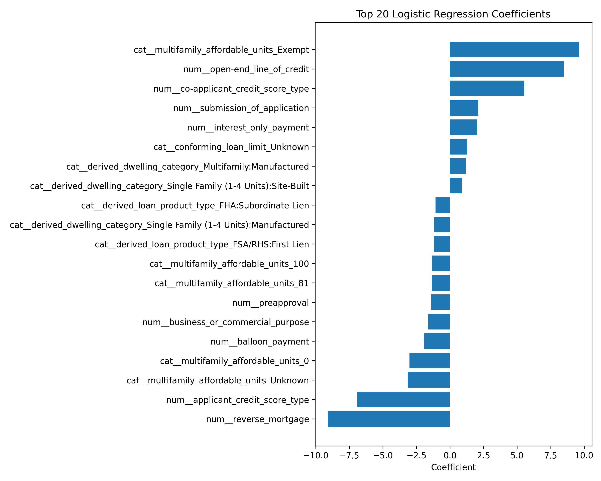

# Predicting HMDA Mortgage Approvals and Evaluating Demographic Fairness

## 1. Project Overview

This project predicts mortgage loan outcomes **(Approved vs. Denied)** using the 2023 Home Mortgage Disclosure Act (HMDA) dataset. We compare four models (**Logistic Regression, Random Forest, XGBoost, and TabPFN**) and conduct a post-hoc fairness audit on the best-performing model to ensure equitable lending predictions.

### Motivation

As financial institutions shift toward automated credit scoring, the demand for models that achieve both high predictive accuracy and algorithmic fairness is increasing. This study identifies the top-performing model and evaluates whether prioritizing predictive power inadvertently introduces disparate impact across diverse demographic and geographic groups in Texas.

### Research Questions

- **Model Performance**: Which model yields the most reliable mortgage approval predictions for key Texas metropolitan markets in 2023?

- **Feature Interpretability**: What are the primary financial determinants driving the champion model’s decisions?

- **Algorithmic Fairness & Geography**: Does the selected model exhibit disparities in error or selection rates across protected groups, and do these patterns vary across geographic regions?

---

## 2. Dataset Description

### 2.1. Data Source & Scope

This project utilizes loan-level data provided by the **Consumer Financial Protection Bureau (CFPB)** under the **Home Mortgage Disclosure Act (HMDA)**. HMDA requires U.S. financial institutions to disclose mortgage information to monitor whether they are serving the housing needs of their communities and to identify potential discriminatory lending patterns.

The dataset focuses on the **2023 calendar year** and covers Texas’s "Big Four" metropolitan counties: **Travis (Austin), Harris (Houston), Dallas (Dallas), and Bexar (San Antonio)**.

## 2.2. Data Acquisition

The raw data was retrieved programmatically via the **CFPB HMDA API** using the Python `requests` library. This ensures a fully reproducible and automated pipeline, allowing for consistent data updates and auditing.

## 2.3. Raw Dataset Statistics

- **Observations**: 310,241 mortgage applications (Initial raw count).

- **Features**: 98 variables covering applicant demographics, loan characteristics, property details, and neighborhood-level economic indicators.

- **Target Variable**: loan_approval (Derived from the `action_taken field`).

  [!TIP]
  **Data Storage & Access**
  
  Due to GitHub’s 100MB file size limit, the raw HMDA dataset is stored externally. You can access the data in two ways:

  1. **Direct Download**: 👉 [Google Drive Link](https://drive.google.com/drive/folders/1y5r9Sv6s_8ITIrgsAzXTee7e0a_xjZtS?usp=drive_link)

  2. **Local Acquisition**: Run `python3 src/data/hmda_loader.py` in your terminal.

  Detailed variable descriptions are available in 👉 [`data/data_dictionary.md`](data/data_dictionary.md)

## 2.2. Data Preprocessing: Feature Selection & Transformation

This section summarizes the preprocessing pipeline that reduced the original 109 HMDA variables to a finalized set of **44 modeling features**. The process emphasizes **leakage prevention, fairness analysis, and model interpretability**.

### 2.2.1. Feature Selection: Exclusion Logic

To ensure model integrity, we excluded variables that could lead to data leakage or provide redundant information.

#### **A. Logic for Exclusion**
| Category | Rationale | Descriptions of Excluded Variables |
| :--- | :--- | :--- |
| **Data Leakage** | Features determined *after* or during the final credit decision. Including these leads to "cheating" and artificially high accuracy. | **Automated Underwriting (AUS) Results**, **Denial Reasons**, **Pricing Metadata** (Interest rates, fees) |
| **Post-Decision Markers** | Flags that only exist for loans that have already been approved and progressed through the bank's system. | **Purchaser Type**, **HOEPA Status**, **Initially Payable to Institution** |
| **Identifiers & Constants** | Variables with zero variance or unique IDs that do not contribute to generalizable patterns. | **Activity Year** (Fixed 2023), **State Code** (Fixed TX), **LEI** (Legal Entity ID) |
| **Redundancy** | Raw entries replaced by official `derived_*` features for fairness analysis consistency. | **Raw Race/Ethnicity/Sex**, **Observation Flags**, **Binary Age Flags** |
| **High Cardinality** | Geographic codes that are too granular for general patterns. | **Census Tract** (Aggregated into `county_code`) |

#### **B. Detailed Reference of Excluded Variables**
| Sub-category | Variable Names | Description |
| :--- | :--- | :--- |
| **Internal Decisions** | `aus-1` ~ `aus-5` | **Automated Underwriting System Results**; directly indicates if a system recommended approval. |
| **Decision Metadata** | `denial_reason-1` ~ `4` | Specific reasons for denial; only populated *after* the decision is made. |
| **Loan Pricing** | `interest_rate`, `rate_spread`, `total_loan_costs`, `origination_charges` | Finalized pricing data; only available for approved/originated loans. |
| **Demographics** | `applicant_race-1~5`, `applicant_sex`, `applicant_age_above_62` | Raw demographic inputs; replaced by `derived_race`, `derived_sex`, and `applicant_age`. |
| **Administrative** | `lei`, `activity_year`, `state_code`, `purchaser_type` | Legal identifiers and constant values with no predictive variance. |

### 2.2.2. Data Transformation: Feature Engineering

We applied specific transformations to convert raw HMDA strings into model-ready numerical and categorical inputs.

#### **A. Numerical & Ordinal Scaling**
| Feature Type | Transformation Method | Example Mapping |
| :--- | :--- | :--- |
| **Age** | **Ordinal Mapping** (Preserves chronological order) | "25-34" $\rightarrow$ 1, "35-44" $\rightarrow$ 2, ">74" $\rightarrow$ 6 |
| **DTI & Units** | **Range-to-Midpoint** (Converts privacy ranges to continuous values) | "30%-36%" $\rightarrow$ 33.0, "5-24 units" $\rightarrow$ 14.5 |
| **Missing Values** | **Median Imputation** | Null numerical values $\rightarrow$ Median of the column |

#### **B. Categorical Handling**
* **Consistency:** String-based variables (e.g., `loan_purpose`, `property_value`) were retained as categorical dtypes.
* **Imputation:** Missing categorical entries were explicitly mapped to a new **"Unknown"** category to preserve information about data gaps.

### 2.2.3. Target Variable Refinement

The target variable was re-defined to focus strictly on the institution's **credit decision logic**.

| Action Taken | Target Mapping | Rationale |
| :--- | :---: | :--- |
| **Loan Originated (1)** | **1 (Approved)** | Success case where credit was granted. |
| **Application Denied (3)** | **0 (Denied)** | The core failure case for prediction. |
| **Withdrawn/Incomplete (4, 5)** | **Excluded** | Removed to filter out noise where no definitive decision was made by the bank. |

After filtering for definitive credit decisions (Approved vs. Denied), the dataset size was refined from **310,241** to **195,474** observations. This ensures the model learns strictly from the institution's risk assessment outcomes, excluding administrative noise such as withdrawn or incomplete applications.

### 2.3. Variables 

#### Target Variable (1)
| Variable Name | Description | Values / Range |
|---------------|-------------|----------------|
| `target` | Final outcome of the application | **1:** Approved, **0:** Denied |

#### 1. Institutional & Geographic Metadata (5)
| Variable Name | Description | Values / Range |
|---------------|-------------|----------------|
| `derived_msa-md` | Metropolitan Statistical Area/Division code | 5-digit FIPS (e.g., 12420, 26420, 19100, 41700) |
| `county_code` | Five-digit FIPS county code | 48453 (Travis), 48201 (Harris), 48113 (Dallas), 48029 (Bexar) |
| `conforming_loan_limit` | Within GSE (Fannie/Freddie) limits | **C:** Conforming, **NC:** Non-conforming, **U:** Unknown |
| `derived_loan_product_type` | Categorization of the loan product | Conventional, FHA, VA, FSA/RHS (with Lien status) |
| `derived_dwelling_category` | Categorization of the dwelling type | Single Family (1-4 Units), Multifamily (5+) |

#### 2. Loan Application Details (10)
| Variable Name | Description | Values / Range |
|---------------|-------------|----------------|
| `preapproval` | Pre-approval request status | **1:** Requested, **2:** Not requested |
| `loan_type` | Type of loan | **1:** Conventional, **2:** FHA, **3:** VA, **4:** USDA |
| `loan_purpose` | Purpose of the loan | **1:** Purchase, **2:** Improvement, **31:** Refi, **32:** Cash-out Refi, **4:** Other |
| `lien_status` | Lien priority | **1:** First Lien, **2:** Subordinate Lien |
| `reverse_mortgage` | Reverse mortgage flag | **1:** Yes, **2:** No |
| `open-end_line_of_credit` | HELOC/Open-end flag | **1:** Yes, **2:** No |
| `business_or_commercial_purpose` | Business purpose flag | **1:** Yes, **2:** No |
| `loan_amount` | Requested loan amount | Numeric (Continuous) |
| `loan_to_value_ratio` | Loan-to-Value (LTV) | Numeric (Continuous, Midpoint converted) |
| `loan_term` | Loan maturity in months | Numeric (Continuous) |

#### 3. Pricing & Property Features (6)
| Variable Name | Description | Values / Range |
|---------------|-------------|----------------|
| `negative_amortization` | Negative amortization flag | **1:** Yes, **2:** No |
| `interest_only_payment` | Interest-only payment flag | **1:** Yes, **2:** No |
| `balloon_payment` | Balloon payment flag | **1:** Yes, **2:** No |
| `other_nonamortizing_features` | Other non-standard payment features | **1:** Yes, **2:** No |
| `property_value` | Appraised property value | Numeric (Continuous) |
| `construction_method` | Property construction type | **1:** Site-built, **2:** Manufactured |

#### 4. Property & Occupancy (6)
| Variable Name | Description | Values / Range |
|---------------|-------------|----------------|
| `occupancy_type` | Intended use of property | **1:** Primary, **2:** Second Home, **3:** Investment |
| `manufactured_home_secured_property_type` | Security type for manufactured | **1:** Real Property, **2:** Personal Property, **3:** N/A |
| `manufactured_home_land_property_interest` | Land interest for manufactured | **1:** Direct, **2:** Indirect, **3:** Paid Lease, **4:** Unpaid, **5:** N/A |
| `total_units` | Number of dwelling units | Numeric (Continuous, Midpoint: 1, 2, 3, 4, 14.5, 60, 150) |
| `multifamily_affordable_units` | Affordable units for multifamily | Numeric (Continuous) or "Unknown" |
| `income` | Applicant(s) gross annual income | Numeric (Continuous, in Thousands) |

#### 5. Credit & Submission Metrics (4)
| Variable Name | Description | Values / Range |
|---------------|-------------|----------------|
| `debt_to_income_ratio` | Debt-to-Income (DTI) ratio | Numeric (Continuous, Midpoint: 20, 33, 41, 48, 55, etc.) |
| `applicant_credit_score_type` | Credit score model used | **1-3:** Credit Bureau, **4:** Vantage, **5:** Multi-model, **6:** Other, **9:** N/A |
| `co-applicant_credit_score_type` | Credit score model for co-app | **1-9:** Same as above, **10:** No co-applicant |
| `submission_of_application` | Submission channel | **1:** Directly to institution, **2:** Not direct, **3:** N/A |

#### 6. Applicant Demographics (Fairness Variables) (5)
| Variable Name | Description | Values / Range |
|---------------|-------------|----------------|
| `derived_ethnicity` | Aggregate ethnicity | Hispanic or Latino, Not Hispanic or Latino, Joint, Unknown |
| `derived_race` | Aggregate race | White, Black, Asian, Am-Indian, Pacific-Islander, Joint, Unknown |
| `derived_sex` | Aggregate sex | Male, Female, Joint, Unknown |
| `applicant_age` | Applicant age (Mapped Ordinal) | **0:** <25, **1:** 25-34, **2:** 35-44, **3:** 45-54, **4:** 55-64, **5:** 65-74, **6:** >74 |
| `co-applicant_age` | Co-applicant age (Mapped Ordinal) | **0-6:** Same as above, **999:** No co-applicant (Imputed to Median) |

#### 7. Census Tract Demographics (7)
| Variable Name | Description | Values / Range |
|---------------|-------------|----------------|
| `tract_population` | Tract total population | Numeric (Continuous) |
| `tract_minority_population_percent` | Minority % in tract | Numeric (Percentage) |
| `ffiec_msa_md_median_family_income` | MSA median family income | Numeric (Continuous) |
| `tract_to_msa_income_percentage` | Relative tract income | Numeric (Percentage) |
| `tract_owner_occupied_units` | Owner-occupied count | Numeric (Continuous) |
| `tract_one_to_four_family_homes` | 1-4 family home count | Numeric (Continuous) |
| `tract_median_age_of_housing_units` | Median housing age | Numeric (Years) |

### 2.4. Train / Test Split

The processed dataset is split into training and testing sets to ensure robust model evaluation and prevent overfitting.

| Set | Proportion | Observations | Description |
| :--- | :---: | :---: | :--- |
| **Training Set** | 80% | 156,379 | Used for model learning and hyperparameter tuning. |
| **Testing Set** | 20% | 39,095 | Used for final performance and fairness auditing. |
| **Total** | **100%** | **195,474** | Observations with definitive credit decisions. |

#### **Methodology**
* **Stratified Sampling:** We applied stratification on the `target` column to preserve the original distribution of approved and denied loans in both the training and testing sets. This prevents bias that could arise from class imbalance.
* **Reproducibility:** A fixed `random_state=42` was used to ensure that the split remains consistent across different environments and runs.
* **Data Storage:** The split datasets are exported as `train.csv` and `test.csv` in the `data/split/` directory for use in the modeling pipeline.

### 2.5. Data Limitations

While the 2023 HMDA dataset provides a comprehensive view of mortgage applications, several inherent limitations must be considered when interpreting the model's results:

1. **Absence of Numerical Credit Scores:** HMDA data excludes actual credit scores to protect applicant privacy. Since credit scores are primary determinants of lending risk, their absence may constrain the model's predictive precision and its ability to replicate internal underwriting logic.
2. **Missing Asset and Wealth Data:** The dataset focuses on applicant income but lacks information on total liquid assets, net worth, or specific down payment sources. An applicant with low income but high assets might still be a low-risk candidate, a nuance the current model cannot capture.
3. **Macroeconomic Context (2023):** The data reflects the 2023 mortgage market, a period characterized by significant interest rate hikes and inflationary pressure. Consequently, the patterns observed may not perfectly generalize to different economic cycles or low-interest-rate environments.
4. **Unobserved Qualitative Factors:** Mortgage decisions often rely on "soft information" or qualitative assessments—such as employment stability, long-term banking relationships, or detailed property appraisals, which are not captured in the standardized HMDA variables.

---


## 3. Modeling Approach and Individual Model Results

### 3.1. Logistic Regression

#### 1. Performance Summary

| Metric | Value |
|---|---:|
| Accuracy | 0.7533 |
| Precision (Approved) | 0.8632 |
| Recall (Approved) | 0.7731 |
| F1 Score | 0.8156 |
| ROC-AUC | 0.8117 |
| Average Precision | 0.9011 |

Evaluated on 39,095 held-out test samples.

#### 2. Confusion Matrix & ROC Curve

| Confusion Matrix | ROC Curve |
|---|---|
|  |  |

#### 3. Precision–Recall Curve & Feature Importance

| Precision–Recall Curve | Top 20 Coefficients |
|---|---|
|  |  |

Top 5 drivers (absolute coefficient magnitude):

- multifamily_affordable_units = Exempt
- reverse_mortgage
- open-end_line_of_credit
- applicant_credit_score_type
- co-applicant_credit_score_type

#### 4. Interpretation

Logistic Regression serves as the interpretable baseline model for the mortgage approval classification task. It performs reasonably well overall, especially in predicting approved loans, with strong precision (0.8632) and a solid F1 score (0.8156). However, its performance is weaker for denied loans, which reflects both class imbalance and the limited flexibility of a linear classifier relative to more complex nonlinear models.

The model’s ROC-AUC of 0.8117 shows that it provides meaningful discrimination between approved and denied applications, but it remains below the XGBoost benchmark currently reported in the project. This is expected, since Logistic Regression assumes a linear relationship between predictors and approval probability, while tree-based methods can capture richer interactions and nonlinearities. Still, Logistic Regression is valuable because it is transparent, fast to estimate, and easy to interpret through coefficient signs and magnitudes.

### 3.2. Random Forest

#### 1. Performance Summary

| Metric               | Value  |
|----------------------|:------:|
| Accuracy             | 0.8151 |
| Precision (Approved) | 0.9012 |
| Recall (Approved)    | 0.8289 |
| F1 Score             | 0.8636 |
| ROC-AUC              | 0.8907 |
| Average Precision    | 0.9426 |

_Evaluated on 39,095 held-out test samples._

#### 2. Confusion Matrix & ROC Curve

| Confusion Matrix | ROC Curve |
|---|---|
|  |  |

#### 3. Precision–Recall Curve & Feature Importance

| Precision–Recall Curve | Top 20 Feature Importances |
|---|---|
|  |  |

### 3.3. XGBoost

#### 1. Performance Summary

| Metric               | Value  |
|----------------------|:------:|
| Accuracy             | 0.8471 |
| Precision (Approved) | 0.9087 |
| Recall (Approved)    | 0.8709 |
| F1 Score             | 0.8894 |
| ROC-AUC              | 0.9109 |
| Average Precision    | 0.9529 |

_Evaluated on 39,095 held-out test samples._

#### 2. Confusion Matrix & ROC Curve

| Confusion Matrix | ROC Curve |
|:---:|:---:|
|  |  |

#### 3. Precision–Recall Curve & Feature Importance

| Precision–Recall Curve | Top 20 Feature Importances |
|:---:|:---:|
|  | |

### 3.4. TabPFN

#### 1. Performance Summary
| Metric               | Value  |
|----------------------|:------:|
| Accuracy             | 0.8362 |
| Precision (Approved) | 0.8491 |
| Recall (Approved)    | 0.9340 |
| F1 Score             | 0.8895 |
| ROC-AUC              | 0.8758 |
| Average Precision    | 0.9300 |

*Evaluated on 39,095 held-out test samples. Trained on 1,000 stratified-subsampled rows.

#### 2. Confusion Matrix & ROC Curve
| Confusion Matrix | ROC Curve |
|:---:|:---:|
|  |  |

#### 3. Precision–Recall Curve & Feature Importance
| Precision–Recall Curve | Top 20 Feature Importances |
|:---:|:---:|
|  | |


## 4. Comparative Evaluation of Models

### 4.1. Performance Metrics (can be changed)

- Accuracy  
- Precision  
- Recall  
- F1‑Score  
- ROC‑AUC  
- Confusion Matrix  

### 4.2. Actual vs Predicted

- Confusion Matrix (per model)  
- ROC Curve Comparison  
- Precision–Recall Curve Comparison  

### 4.3. Top 5 Feature Importances

- Logistic Regression: absolute coefficients  
- Random Forest: Gini importance  
- XGBoost / CatBoost: gain or split importance  

### 4.4. Top 20 Feature Importances

- Based on the best-performing model  
- (Optional) SHAP summary plot for interpretability  

### 4.5. Key Takeaways and Recommendations

- Comparative performance summary  
- Most influential predictors  
- Practical and fairness-related implications  

## 5. Evaluation for Demographic Fairness

To ensure the mortgage approval model does not perpetuate systemic biases, we conducted a comprehensive **Post-hoc Fairness Audit** to detect indirect discrimination caused by proxy variables while maintaining the model's predictive power.

### Why Post-hoc Audit? (vs. Fairness through Blindness)

**Fairness through Blindness** simply removes sensitive attributes (e.g., race, gender) from the training data to ensure a fair model. However, this approach is often ineffective due to **Proxy Variables**. Even if explicit labels are removed, other features like zipcode, loan_amount, or income often correlate strongly with protected attributes. This allows the model to "learn" and perpetuate historical biases indirectly (e.g., digital redlining).

To address this, we adopted the **Post-hoc Fairness Audit** approach. Instead of hiding sensitive information, we include these variables to explicitly measure and audit the model's performance across different demographics. This allows for a more transparent assessment of **Disparate Impact** and enables us to identify precisely where the model's predictions might deviate from fairness standards.

### 5.1. Methodology

We evaluated our best-performing model (**XGBoost**) across the following four steps:

#### Step 1: Full-Feature Prediction

The model was trained on the complete dataset (including demographic variables) to capture the most accurate representation of the decision-making process.

#### Step 2: Subgroup Definition

We categorized the test data into the following sensitive groups to assess potential disparities:

- Race (`derived_race`): White, Black, and Other (Composite of Asian, Am-Indian, Pacific-Islander, and Joint). Note: 'Unknown' cases were excluded for audit clarity.

- Age (`applicant_age`): Seven ordinal bins (from <25 to >74).

- Gender (`derived_sex`): Male, Female. Note: 'Joint' and 'Unknown' were excluded.

- Region (`county_code`): Four major Texas metropolitan counties: Travis (Austin), Harris (Houston), Dallas (Dallas), and Bexar (San Antonio).

#### Step 3: Performance Metrics by Subgroup

For each subgroup, we calculated key performance indicators (KPIs):

- Selection Rate: The proportion of applications predicted as 'Approved'.

- True Positive Rate (TPR): The model's ability to correctly identify qualified applicants within the group.

- False Positive Rate (FPR): The frequency of unqualified applicants being predicted as 'Approved'.

#### Step 4: Fairness Criteria Assessment

We measured fairness using two industry-standard definitions:

- Demographic Parity: Evaluating whether the Selection Rate is consistent across different groups (testing for the 4/5 Rule).

- Equalized Odds: Ensuring that the TPR and FPR are balanced across groups, meaning the model's error profile is not biased against specific demographics.

#### Step 5: Model Explainability (SHAP Analysis)

- Using the SHAP (SHapley Additive exPlanations) library, we analyzed the global feature importance. This step verifies how much weight the model assigns to sensitive attributes versus financial indicators (e.g., DTI, LTV), identifying potential proxy-based discrimination.


### 5.2. Demographic Fairness Audit Results

We conducted a post-hoc audit to evaluate the model's fairness across four protected attributes. While some disparities in selection rates exist, the **high True Positive Rate (TPR)** and **SHAP explanations** suggest that the model's decisions are primarily driven by legitimate financial factors rather than demographic bias.

#### 5.2.1. Race: High TPR despite Selection Rate Gaps


- **Observations**: The **Asian (0.823)** and **White (0.790)** groups showed the highest selection rates, while the **African American (0.672)** group recorded the lowest.

- **Fairness Insight**: Despite the gap in selection rates, the **TPR (Recall) is consistently above 0.95** for all racial groups. This indicates that the model is equally effective at identifying "qualified" applicants across all races. The disparity in selection rates is likely a reflection of historical economic disparities in the underlying data rather than algorithmic discrimination.

The model satisfies the U.S. **EEOC(Equal Employment Opportunity Commission)’s 4/5 rule (80% rule)** for disparate impact. The ratio of selection rates between African American (0.672) and Asian (0.823) applicants is approximately **81.6%**, which exceeds the 80% threshold.

#### 5.2.2. Age: Peak Performance in Early-to-Mid Career


- **Observations**: Selection rates peak in the **25-34 (0.833)** age group and gradually decline as age increases, reaching a minimum of **0.661 for the >74** group.

- **Fairness Insight**: Error rates (TPR/FPR) remain stable across all age bins. The lower selection rates for older applicants may correlate with mortgage terms and retirement income structures, which the model captures through financial variables.

#### 5.2.3. Gender: Minimal Disparity


- **Observations**: The selection rate for **Male (0.734)** applicants is slightly higher than for **Female (0.710)** applicants.

- **Fairness Insight**: The difference is marginal (approx. 2.4%), and the error profiles (TPR/FPR) are nearly identical. The model demonstrates high demographic parity regarding gender.

#### 5.2.4. County: Geographic Consistency (No Redlining)


- **Observations**: Selection rates across the four major Texas counties are remarkably stable, ranging from **0.752 (Dallas)** to **0.778 (Travis)**.

- **Fairness Insight**: The lack of significant variance suggests that the model does not exhibit geographic bias (redlining) within these metropolitan areas.

#### 5.2.5. Model Interpretation via SHAP


The **SHAP Summary Plot** confirms that the model's top predictors are strictly financial and risk-related:

1. **Debt-to-Income Ratio (DTI)**: The most influential feature.

2. **Loan-to-Value Ratio (LTV) & Property Value**: Primary risk indicators.

3. **Protected Attributes**: Variables such as `derived_race` and `derived_sex` ranked much lower in global importance, further proving that the model relies on economic merit rather than demographic proxies.

#### 5.2.6. Quantitative Fairness Assessment (DP and EO Diff)

**The Demographic Parity Difference (DP Diff)** and **Equalized Odds Difference (EO Diff)** quantify the fairness gaps between groups.

- **Gender & County**: Showed very low DP Diff (e.g., **0.023** for Gender), confirming near-perfect parity across these attributes.

- **Race & Age**: While showing slightly higher gaps, the model maintains high **True Positive Rates (TPR > 0.95)** across all categories, ensuring that qualified applicants are treated fairly regardless of their group.

- **Legal Standard**: Notably, the model satisfies the **EEOC’s 4/5 Rule**. The selection rate ratio between African American and Asian applicants is **81.6%**, exceeding the 80% threshold for non-discriminatory practices.

#### 5.2.7. Detailed Audit Metrics (Appendix)

<details>
<summary>👉 Click to view raw fairness data</summary>

#### Overall Fairness Differences
| Attribute | Demographic Parity Diff | Equalized Odds Diff |
| :--- | :--- | :--- |
| **Race** | 0.1504 | 0.0927 |
| **Age** | 0.1724 | 0.0729 |
| **Gender** | 0.0235 | 0.0072 |
| **County** | 0.0257 | 0.0526 |

#### Detailed Metrics by Race and Gender
| Group | Accuracy | Selection Rate | TPR (Recall) | FPR |
| :--- | :--- | :--- | :--- | :--- |
| **African American** | 0.8920 | 0.6724 | 0.9588 | 0.2148 |
| **White** | 0.9164 | 0.7900 | 0.9820 | 0.2636 |
| **Asian** | 0.9332 | 0.8228 | 0.9875 | 0.2543 |
| **Male** | 0.9090 | 0.7335 | 0.9721 | 0.2255 |
| **Female** | 0.9054 | 0.7100 | 0.9711 | 0.2183 |

*(Note: Full results for all Age bins and Counties are available in the reports/results/fairness/ directory.)*
</details>


## 6. Reproducibility

### 6.1. Clone the repository  
```
git clone https://github.com/nks1216/ml-final.git
cd ml-final
```

### 6.2. Setting up the Virtual Environment

- Create a virtual environment: `python3 -m venv venv`
- Activate the virtual environment: `source venv/bin/activate`
- Install all required packages: `pip install -r requirements.txt`

### 6.3. Data Preparation

Run the scripts in the following order to collect and prepare the dataset:

1. Download Raw Data: Fetches 2023 HMDA data for Big 4 TX counties.

```
python3 src/data/hmda_loader.py
```

2. Clean Data: Performs preprocessing and prevents data leakage.

```
python3 src/data/clean_hmda.py
```

3. Split Data: Creates train.csv and test.csv in data/split/.

```
python3 src/data/split_data.py
```

### 6.4 Run the code
```

```
For convenience, individual model scripts are provided.

---

## 7. Limitations and Future Improvements

**Modeling Limitations**

**Future Improvements**

---

## 8. Collaboration and Workflow

- All team members worked through GitHub Issues and feature branches, following a branch‑per‑issue workflow.
- Each member opened pull requests for their work and merged them after review and testing.
- The repository contains more than 30 commits across multiple contributors.
- All code and documentation were merged into the main branch before submission.


## Further Feasible Extensions:

- Data quality and missingness analysis

- Fairness metrics (e.g., demographic parity, equal opportunity)

- Explainability using SHAP or permutation importance

- County‑level heterogeneity analysis

- Class imbalance handling

- Train/validation/test split strategy
