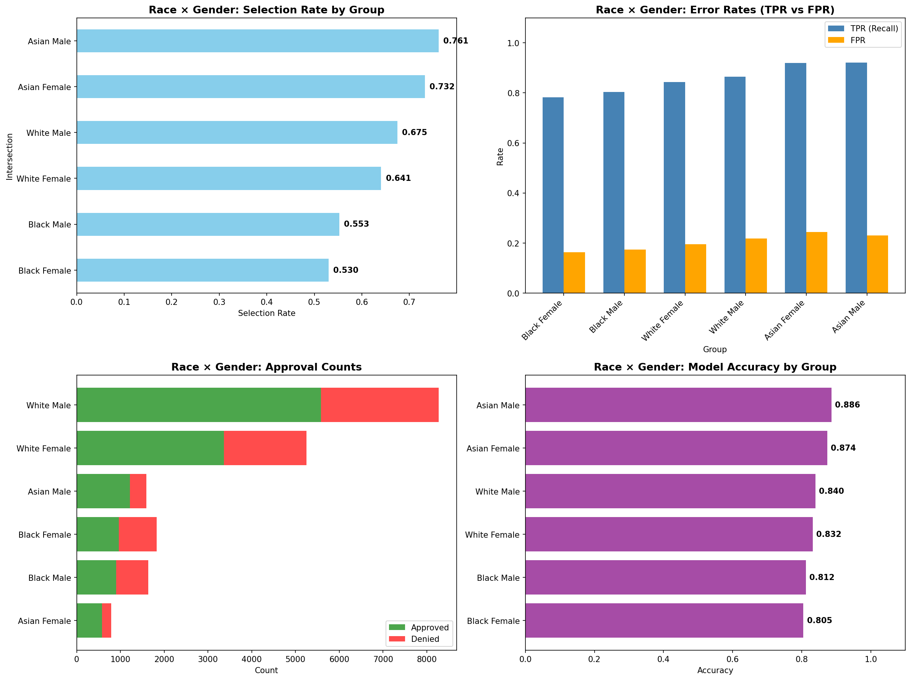
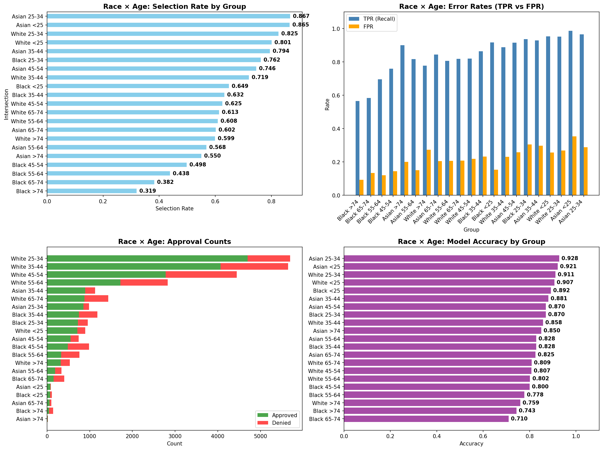
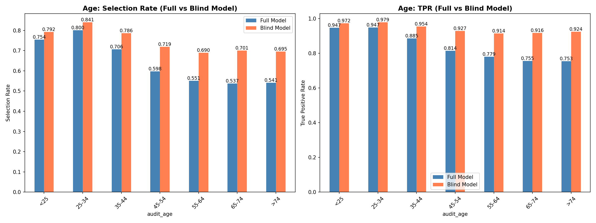
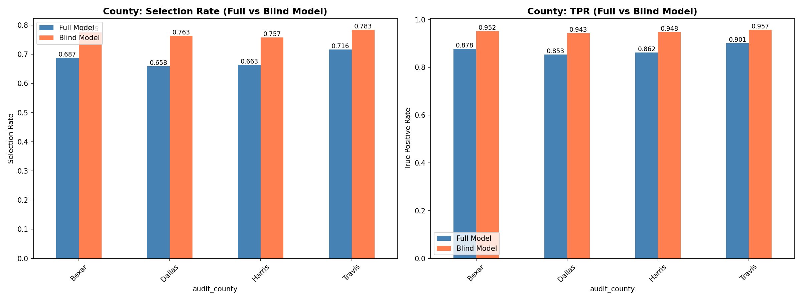
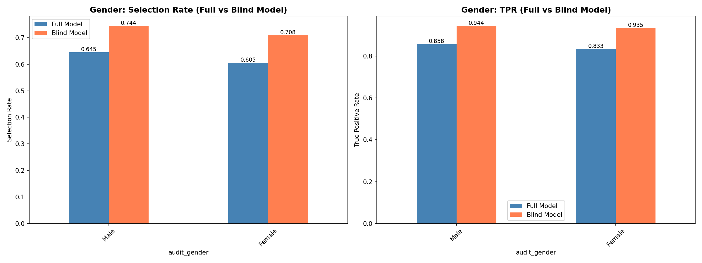
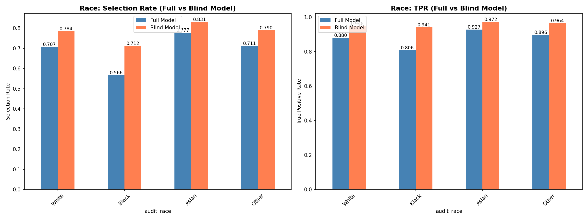
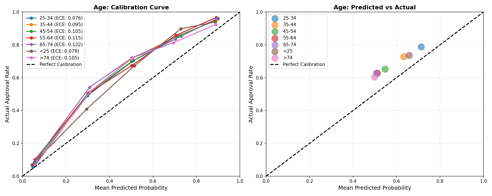
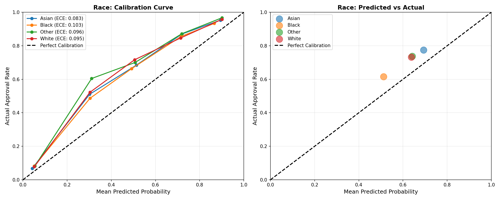
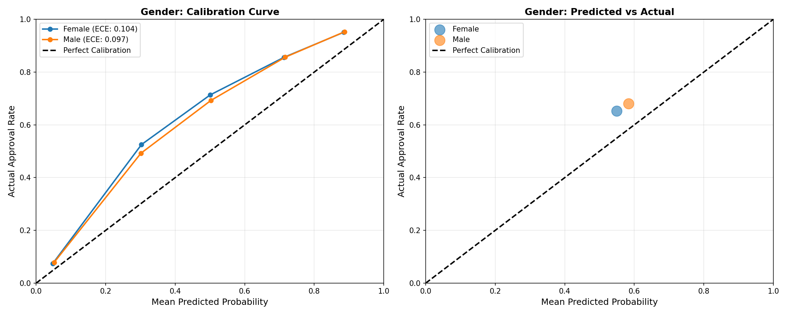
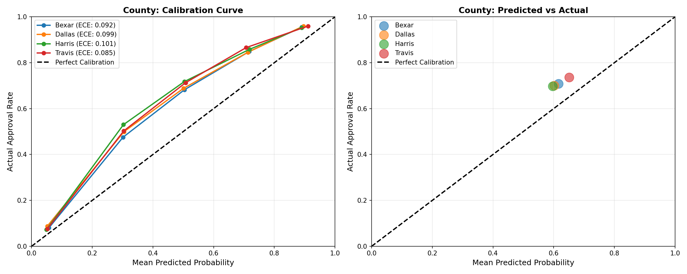

# Predicting HMDA Mortgage Approvals and Evaluating Demographic Fairness

## 1. Project Overview

This project predicts mortgage loan outcomes **(Approved vs. Denied)** using the 2023 Home Mortgage Disclosure Act (HMDA) dataset. We compare four models (**Logistic Regression, Random Forest, XGBoost, and TabPFN**) and conduct mainly a post-hoc fairness audit on the best-performing model to ensure equitable lending predictions.

### Motivation

As financial institutions shift toward automated credit scoring, the demand for models that achieve both high predictive accuracy and algorithmic fairness is increasing. This study identifies the top-performing model and evaluates whether prioritizing predictive power inadvertently introduces disparate impact across diverse demographic and geographic groups in Texas.

### Research Questions

- **Model Performance**: Which model yields the most reliable mortgage approval predictions for key Texas metropolitan markets in 2023?

- **Feature Interpretability**: What are the primary financial determinants driving the champion model’s decisions?

- **Demographic & Geographic Fairness**: Does the selected model exhibit disparities in error or selection rates across protected groups, and do these patterns vary across geographic regions?

---

## 2. Dataset Description

### 2.1. Data Source & Scope

This project utilizes loan-level data provided by the **Consumer Financial Protection Bureau (CFPB)** under the **Home Mortgage Disclosure Act (HMDA)**. HMDA requires U.S. financial institutions to disclose mortgage information to monitor whether they are serving the housing needs of their communities and to identify potential discriminatory lending patterns.

The dataset focuses on the **2023 calendar year** and covers Texas’s "Big Four" metropolitan counties: **Travis (Austin), Harris (Houston), Dallas (Dallas), and Bexar (San Antonio)**.

### 2.2. Data Acquisition

The raw data was retrieved programmatically via the **CFPB HMDA API** using the Python `requests` library. This ensures a fully reproducible and automated pipeline, allowing for consistent data updates and auditing.

### 2.3. Raw Dataset Statistics

- **Observations**: 310,241 mortgage applications (Initial raw count).

- **Features**: 98 variables covering applicant demographics, loan characteristics, property details, and neighborhood-level economic indicators.

- **Target Variable:** `loan_approval`, derived from the `action_taken` field.

  [!TIP]
  **Data Storage & Access**
  
  Due to GitHub’s 100MB file size limit, the raw HMDA dataset is stored externally. You can access the data in two ways:

  1. **Direct Download**: 👉 [Google drive link](https://drive.google.com/drive/folders/1y5r9Sv6s_8ITIrgsAzXTee7e0a_xjZtS?usp=drive_link)

  2. **Local Acquisition**: Run `python3 src/data/hmda_loader.py` in your terminal.

  Detailed variable descriptions are available in 👉 [`data/data_dictionary.md`](data/data_dictionary.md)

### 2.4 Data Preprocessing: Feature Selection & Transformation

This section summarizes the preprocessing pipeline that reduced the original 109 HMDA variables to a finalized set of **43 modeling features**. The process emphasizes **leakage prevention, fairness analysis, and model interpretability**.

### 2.4.1. Feature Selection: Exclusion Logic

To ensure model integrity, we excluded variables that could lead to data leakage or provide redundant information. Features were selected based on **Ex-ante** information available at the time of application. **Ex-post** markers (e.g., interest rates, total loan costs) and post-decision identifiers were excluded to prevent **data leakage** and focus strictly on the predictive factors of the credit decision.

#### **A. Logic for Exclusion**
| Category | Rationale | Descriptions of Excluded Variables |
| :--- | :--- | :--- |
| **Data Leakage** | Features determined *after* or during the final credit decision. Including these leads to "cheating" and artificially high accuracy. | Automated Underwriting (AUS) Results, Denial Reasons, Pricing Metadata (Interest rates, fees) |
| **Post-Decision Markers** | Flags that only exist for loans that have already been approved and progressed through the bank's system. | Purchaser Type, HOEPA Status, Initially Payable to Institution |
| **Identifiers & Constants** | Variables with zero variance or unique IDs that do not contribute to generalizable patterns. | Activity Year (Fixed 2023), State Code (Fixed TX), LEI (Legal Entity ID) |
| **Redundancy** | Raw entries replaced by official `derived_*` features for fairness analysis consistency. | Raw Race/Ethnicity/Sex, Observation Flags, Binary Age Flags |
| **High Cardinality** | Geographic codes that are too granular for general patterns. | Census Tract (Aggregated into `county_code`) |

#### **B. Detailed Reference of Excluded Variables**
| Sub-category | Variable Names | Description |
| :--- | :--- | :--- |
| **Internal Decisions** | `aus-1` ~ `aus-5` | Automated Underwriting System Results; directly indicates if a system recommended approval. |
| **Decision Metadata** | `denial_reason-1` ~ `4` | Specific reasons for denial; only populated *after* the decision is made. |
| **Loan Pricing** | `interest_rate`, `rate_spread`, `total_loan_costs`, `origination_charges` | Finalized pricing data; only available for approved/originated loans. |
| **Demographics** | `applicant_race-1~5`, `applicant_sex`, `applicant_age_above_62` | Raw demographic inputs; replaced by `derived_race`, `derived_sex`, and `applicant_age`. |
| **Administrative** | `lei`, `activity_year`, `state_code`, `purchaser_type` | Legal identifiers and constant values with no predictive variance. |

### 2.4.2. Data Transformation: Feature Engineering

We applied specific transformations to convert raw HMDA strings into model-ready numerical and categorical inputs.

#### **A. Numerical & Ordinal Scaling**
| Feature Type | Transformation Method | Example Mapping |
| :--- | :--- | :--- |
| **Age** | **Ordinal Mapping** (Preserves chronological order) | "25-34" $\rightarrow$ 1, "35-44" $\rightarrow$ 2, ">74" $\rightarrow$ 6 |
| **DTI & Units** | **Range-to-Midpoint** (Converts privacy ranges to continuous values) | "30%-36%" $\rightarrow$ 33.0, "5-24 units" $\rightarrow$ 14.5 |
| **Missing Values** | **Median Imputation** | Null numerical values $\rightarrow$ Median of the column |

#### **B. Categorical Handling**
* **Consistency:** String-based variables (e.g., `loan_purpose`, `property_value`) were retained as categorical dtypes.
* **Imputation:** Missing categorical entries were explicitly mapped to a new **"Unknown"** category to preserve information about data gaps.

### 2.4.3. Target Variable Refinement

The target variable was re-defined to focus strictly on the institution's **credit decision logic**.

| Action Taken | Target Mapping | Rationale |
| :--- | :---: | :--- |
| **Loan Originated (1)** | **1 (Approved)** | Success case where credit was granted and the loan was issued. |
| **Approved but Not Accepted (2)** | **Excluded** | We excluded ambiguous cases to focus on a clear contrast between finalized loans and official rejections. |
| **Application Denied (3)** | **0 (Denied)** | The core failure case where the bank formally rejected the application. |
| **Withdrawn/Incomplete (4, 5)** | **Excluded** | Removed to filter out noise where no definitive decision was made by the bank. |

After filtering for definitive credit decisions (Approved vs. Denied), the dataset size was refined from **310,241** to **195,474** observations. This ensures the model learns strictly from the institution's risk assessment outcomes, excluding administrative noise such as withdrawn or incomplete applications.

### 2.5 Variables

#### Target Variable (1)
| Variable Name | Description | Values / Range |
|---------------|-------------|----------------|
| `target` | Final outcome of the application | **1:** Approved, **0:** Denied |

#### 1. Institutional & Geographic Metadata (5)
| Variable Name | Description | Values / Range |
|---------------|-------------|----------------|
| `derived_msa-md` | Metropolitan Statistical Area/Division code | 5-digit FIPS (e.g., 12420, 26420, 19100, 41700) |
| `county_code` | Five-digit FIPS county code | 48453 (Travis), 48201 (Harris), 48113 (Dallas), 48029 (Bexar) |
| `conforming_loan_limit` | Within GSE (Fannie/Freddie) limits | **C:** Conforming, **NC:** Non-conforming, **U:** Unknown |
| `derived_loan_product_type` | Categorization of the loan product | Conventional, FHA, VA, FSA/RHS (with Lien status) |
| `derived_dwelling_category` | Categorization of the dwelling type | Single Family (1-4 Units), Multifamily (5+) |

#### 2. Loan Application Details (10)
| Variable Name | Description | Values / Range |
|---------------|-------------|----------------|
| `preapproval` | Pre-approval request status | **1:** Requested, **2:** Not requested |
| `loan_type` | Type of loan | **1:** Conventional, **2:** FHA, **3:** VA, **4:** USDA |
| `loan_purpose` | Purpose of the loan | **1:** Purchase, **2:** Improvement, **31:** Refi, **32:** Cash-out Refi, **4:** Other |
| `lien_status` | Lien priority | **1:** First Lien, **2:** Subordinate Lien |
| `reverse_mortgage` | Reverse mortgage flag | **1:** Yes, **2:** No |
| `open-end_line_of_credit` | HELOC/Open-end flag | **1:** Yes, **2:** No |
| `business_or_commercial_purpose` | Business purpose flag | **1:** Yes, **2:** No |
| `loan_amount` | Requested loan amount | Numeric (Continuous) |
| `loan_to_value_ratio` | Loan-to-Value (LTV) | Numeric (Continuous, Midpoint converted) |
| `loan_term` | Loan maturity in months | Numeric (Continuous) |

#### 3. Pricing & Property Features (6)
| Variable Name | Description | Values / Range |
|---------------|-------------|----------------|
| `negative_amortization` | Negative amortization flag | **1:** Yes, **2:** No |
| `interest_only_payment` | Interest-only payment flag | **1:** Yes, **2:** No |
| `balloon_payment` | Balloon payment flag | **1:** Yes, **2:** No |
| `other_nonamortizing_features` | Other non-standard payment features | **1:** Yes, **2:** No |
| `property_value` | Appraised property value | Numeric (Continuous) |
| `construction_method` | Property construction type | **1:** Site-built, **2:** Manufactured |

#### 4. Property & Occupancy (6)
| Variable Name | Description | Values / Range |
|---------------|-------------|----------------|
| `occupancy_type` | Intended use of property | **1:** Primary, **2:** Second Home, **3:** Investment |
| `manufactured_home_secured_property_type` | Security type for manufactured | **1:** Real Property, **2:** Personal Property, **3:** N/A |
| `manufactured_home_land_property_interest` | Land interest for manufactured | **1:** Direct, **2:** Indirect, **3:** Paid Lease, **4:** Unpaid, **5:** N/A |
| `total_units` | Number of dwelling units | Numeric (Continuous, Midpoint: 1, 2, 3, 4, 14.5, 60, 150) |
| `multifamily_affordable_units` | Affordable units for multifamily | Numeric (Continuous) or "Unknown" |
| `income` | Applicant(s) gross annual income | Numeric (Continuous, in Thousands) |

#### 5. Credit & Submission Metrics (4)
| Variable Name | Description | Values / Range |
|---------------|-------------|----------------|
| `debt_to_income_ratio` | Debt-to-Income (DTI) ratio | Numeric (Continuous, Midpoint: 20, 33, 41, 48, 55, etc.) |
| `applicant_credit_score_type` | Credit score model used | **1-3:** Credit Bureau, **4:** Vantage, **5:** Multi-model, **6:** Other, **9:** N/A |
| `co-applicant_credit_score_type` | Credit score model for co-app | **1-9:** Same as above, **10:** No co-applicant |
| `submission_of_application` | Submission channel | **1:** Directly to institution, **2:** Not direct, **3:** N/A |

#### 6. Applicant Demographics (Fairness Variables) (5)
| Variable Name | Description | Values / Range |
|---------------|-------------|----------------|
| `derived_ethnicity` | Aggregate ethnicity | Hispanic or Latino, Not Hispanic or Latino, Joint, Unknown |
| `derived_race` | Aggregate race | White, Black, Asian, Am-Indian, Pacific-Islander, Joint, Unknown |
| `derived_sex` | Aggregate sex | Male, Female, Joint, Unknown |
| `applicant_age` | Applicant age (Mapped Ordinal) | **0:** <25, **1:** 25-34, **2:** 35-44, **3:** 45-54, **4:** 55-64, **5:** 65-74, **6:** >74 |
| `co-applicant_age` | Co-applicant age (Mapped Ordinal) | **0-6:** Same as above, **999:** No co-applicant (Imputed to Median) |

#### 7. Census Tract Demographics (7)
| Variable Name | Description | Values / Range |
|---------------|-------------|----------------|
| `tract_population` | Tract total population | Numeric (Continuous) |
| `tract_minority_population_percent` | Minority % in tract | Numeric (Percentage) |
| `ffiec_msa_md_median_family_income` | MSA median family income | Numeric (Continuous) |
| `tract_to_msa_income_percentage` | Relative tract income | Numeric (Percentage) |
| `tract_owner_occupied_units` | Owner-occupied count | Numeric (Continuous) |
| `tract_one_to_four_family_homes` | 1-4 family home count | Numeric (Continuous) |
| `tract_median_age_of_housing_units` | Median housing age | Numeric (Years) |

### 2.6 Train / Test Split

The processed dataset is split into training and testing sets to ensure robust model evaluation and prevent overfitting.

| Set | Proportion | Observations | Description |
| :--- | :---: | :---: | :--- |
| **Training Set** | 80% | 156,379 | Used for model learning and hyperparameter tuning. |
| **Testing Set** | 20% | 39,095 | Used for final performance and fairness auditing. |
| **Total** | **100%** | **195,474** | Observations with definitive credit decisions. |

#### **Methodology**
* **Stratified Sampling:** We applied stratification on the `target` column to preserve the original distribution of approved and denied loans in both the training and testing sets. This prevents bias that could arise from class imbalance.
* **Reproducibility:** A fixed `random_state=42` was used to ensure that the split remains consistent across different environments and runs.
* **Data Storage:** The split datasets are exported as `train.csv` and `test.csv` in the `data/split/` directory for use in the modeling pipeline.

### 2.7 Data Limitations

While the 2023 HMDA dataset provides a comprehensive view of mortgage applications, several inherent limitations must be considered when interpreting the model's results:

1. **Absence of Numerical Credit Scores:** Even though HMDA data includes the types of credit score model, it excludes actual credit scores to protect applicant privacy. Since credit scores are primary determinants of lending risk, their absence may constrain the model's predictive precision and its ability to replicate internal underwriting logic.
2. **Missing Asset and Wealth Data:** The dataset focuses on applicant income but lacks information on total liquid assets, net worth, or specific down payment sources. An applicant with low income but high assets might still be a low-risk candidate, a nuance the current model cannot capture.
3. **Macroeconomic Context (2023):** The data reflects the 2023 mortgage market, a period characterized by significant interest rate hikes and inflationary pressure. Consequently, the patterns observed may not perfectly generalize to different economic cycles or low-interest-rate environments.
4. **Unobserved Qualitative Factors:** Mortgage decisions often rely on "soft information" or qualitative assessments—such as employment stability, long-term banking relationships, or detailed property appraisals, which are not captured in the standardized HMDA variables.

---
## 3. Comparative Evaluation of Models

This section compares the performance of the four classification models used in this project: Logistic Regression, Random Forest, XGBoost, and TabPFN. The goal is to identify which model provides the strongest overall predictive performance on the held-out test set.

### 3.1. Performance Summary

| Model               | Accuracy | Precision | Recall | F1 Score | ROC-AUC | AP |
|---------------------|:--------:|:---------:|:------:|:--------:|:-------:|:------:|
| Logistic Regression | 0.7533   | 0.8632    | 0.7731 | 0.8156   | 0.8117  | 0.9011 |
| Random Forest       | 0.8165   | 0.9007    | 0.8319 | 0.8649   | 0.8919  | 0.9431 |
| **XGBoost**         | **0.8469** | **0.9094** | 0.8697 | **0.8891** | **0.9111** | **0.9530** |
| TabPFN              | 0.8362   | 0.8491    | **0.9340** | 0.8895 | 0.8758  | 0.9300 |

### 3.2. ROC Curve Comparison

The results show a clear improvement from the baseline Logistic Regression model to the more flexible machine learning models. Logistic Regression achieved the lowest overall performance, with an accuracy of 0.7533 and ROC-AUC of 0.8117. This is expected because Logistic Regression assumes a relatively linear relationship between the predictors and the probability of approval.

Random Forest substantially improves on Logistic Regression, increasing accuracy to 0.8165 and ROC-AUC to 0.8919. This suggests that nonlinear relationships and feature interactions are important in predicting mortgage approval outcomes.

XGBoost produced the strongest overall results. It achieved the highest accuracy, precision, ROC-AUC, and average precision among all models. Its ROC-AUC of 0.9109 indicates strong discrimination between approved and denied applications, while its average precision of 0.9529 shows strong performance in ranking likely approvals.

TabPFN also performed well, especially in recall and F1 score. However, its ROC-AUC and average precision are lower than XGBoost. In addition, TabPFN was trained on a smaller stratified subsample (1,000), so it is useful as an experimental comparison model but is not selected as the final champion model.


### 3.3. Confusion Matrix & Precision–Recall Curve Comparison

Confusion matrices were used to compare each model’s predicted outcomes against the actual approval outcomes. These results show how often each model correctly classified approved and denied applications, as well as where each model made errors.

Logistic Regression provides a useful baseline but produces more classification errors than the tree-based models. Random Forest improves the overall classification results, while XGBoost provides the strongest balance between correctly identifying approvals and avoiding incorrect predictions. TabPFN performs strongly in recall, but its lower ROC-AUC and average precision make it less reliable as the final model.

The ROC curve and precision-recall curve comparisons also support XGBoost as the strongest overall model. XGBoost maintains the best discrimination between approved and denied applications and provides the strongest ranking performance across prediction thresholds.


### 3.4. Feature Importance Comparison

Each model uses a different importance metric, so absolute values are not comparable, but the qualitative agreement is informative.

- Logistic Regression flags `multifamily_affordable_units_Exempt`, `reverse_mortgage`, and `open-end_line_of_credit` as the strongest signals — primarily binary regulatory flags that the linear model can directly leverage.  
- Random Forest centers on financial-fundamental variables: `debt_to_income_ratio`, `loan_purpose`, `loan_amount`, and `income`. This is the most "intuitive" set of drivers from a credit-decision perspective.  
- XGBoost highlights structural property features: `derived_dwelling_category`, `manufactured_home_secured_property_type`, and `construction_method`. These are highly correlated proxies for "manufactured vs. site-built housing", which carries strong predictive signal in HMDA.  
- TabPFN identifies `debt_to_income_ratio` as overwhelmingly dominant (drop in ROC-AUC ≈ 0.18), followed by `loan_purpose` and `property_value`. This aligns with what a human underwriter would prioritize.  

The fact that **DTI appears in the top features of three of the four models** strongly suggests it is the most decision-relevant variable in the dataset, with structural housing features serving as a complementary signal that tree-based ensembles exploit especially well.


### 3.5. Key Takeaways and Recommendation

Overall, the model comparison supports three main conclusions.

First, Logistic Regression is a useful interpretable baseline, but it has weaker predictive performance than the more flexible machine learning models.

Second, Random Forest and XGBoost outperform Logistic Regression, suggesting that mortgage approval outcomes involve nonlinear relationships and interactions among borrower, loan, and property characteristics.

Third, XGBoost is the strongest overall model. It achieves the best balance of accuracy, precision, recall, F1 score, ROC-AUC, and average precision. Therefore, XGBoost is selected as the champion model for the final fairness audit and interpretation.

## 4. Evaluation for Demographic Fairness

To evaluate whether the mortgage approval model exhibits performance or selection-rate disparities across demographic and geographic groups, we conducted a comprehensive **Post-hoc Fairness Audit**. Our approach uses **Fairness with Awareness**, meaning the model was trained using all available features—including **Race, Gender, Age, and County**—to maintain full transparency and predictive power.

### Advantages of Audit with Awareness (vs. Fairness through Blindness)

While our project evaluates multiple strategies, including **Fairness through Blindness**, we identified two key advantages of the **Audit with Awareness** approach:

1. **Reduce Hidden Bias** (Proxy Variables): Unlike the "blind" approach, which can be unintentionally bypassed by **Proxy Variables** (e.g., zip codes or debt-to-income ratios that correlate with race), "Awareness" allows us to explicitly track and mitigate these hidden correlations.

2. **Enhance Model Transparency**: By including all 43 features, we gain the ability to explicitly monitor and control the model's weight distribution. This ensures that the model’s predictive power is derived from **Financial Merit** rather than sensitive demographic factors.

### 4.1. Methodology

We evaluated our best-performing model (**XGBoost**) across the following five steps:

#### Step 1: Full-Feature Prediction

The model was already trained on the complete dataset (including demographic variables) in the previous stage to capture the most accurate representation of the decision-making process.

#### Step 2: Subgroup Definition

We categorized the test data into the following sensitive groups to assess potential disparities:

| Category | Column Name | Subgroups & Details |
| :--- | :--- | :--- |
| **Race** | `derived_race` | White, Black, Asian, and Other (Am-Indian, Pacific-Islander, Joint) |
| **Age** | `applicant_age` | Seven ordinal bins (from <25 to >74) |
| **Gender** | `derived_sex` | Male, Female |
| **Region** | `county_code` | Travis (Austin), Harris (Houston), Dallas (Dallas), and Bexar (San Antonio) |

*(Race: 'Unknown' cases excluded. / Gender: 'Joint' and 'Unknown' excluded)*

#### Step 3: Performance Metrics by Subgroup

For each subgroup, we calculated key performance indicators (KPIs):

| Metric | Definition |
| :--- | :--- |
| **Selection Rate** | $\frac{\text{Approved Predictions}}{\text{Total Applications}}$ |
| ↳ *Interpretation* | Measures **Demographic Parity**. Significant gaps indicate the model grants approvals at different rates regardless of historical merit. |
| **TPR** (True Positive Rate) | $\frac{\text{Correctly Predicted "Approved"}}{\text{Hist. Approved Applications}}$ |
| ↳ *Interpretation* | Measures **Opportunity Equity**. A lower TPR suggests the model fails to identify successful candidates, leading to missed opportunities. |
| **FPR** (False Positive Rate) | $\frac{\text{Incorrectly Predicted "Approved"}}{\text{Hist. Denied Applications}}$ |
| ↳ *Interpretation* | Measures **Risk Equity**. A higher FPR indicates unintended leniency or higher risk by approving applications that the historical record rejected. |

- **Result**: Generated 4 detailed tables (metrics_by_{group}.csv) and 4 parity plots.

#### Step 4: Fairness Criteria Assessment

We measured global fairness using two quantitative metrics to provide a rigorous, mathematical verdict on the model's performance:

| Criterion | Calculation Logic | Interpretation & Benchmark |
| :--- | :--- | :--- |
| **Demographic Parity(DP) Difference** | Max gap in Selection Rates between any two groups | **U.S. EEOC 4/5 Rule**: The selection rate of any group should be $\geq$ 80% of the highest-performing group to avoid disparate impact. |
| **Equalized Odds(EO) Difference** | Max difference in either **TPR** or **FPR** across all groups | **Equal Opportunity**: Monitors whether the model is unintentionally stricter or more lenient toward specific demographics. |

(*EEOC: Equal Employment Opportunity Commission*)

- **Result**: Consolidated in `fairness_summary_metrics.csv`.

#### Step 5: Model Explainability (SHAP Analysis)

Using the **SHAP (SHapley Additive exPlanations)** library, we analyzed the global feature importance. This step verifies how much weight the model assigns to demographic attributes versus financial indicators (e.g., DTI, LTV), identifying potential proxy-based discrimination.

- **Result**: Visualized in `reports/figures/fairness/shap_summary_fairness.png`.

### 4.2. Demographic Fairness Audit Results

We evaluated the model's fairness across four protected attributes. While Gender and County maintain high parity, significant disparities in Race and Age highlight the impact of socio-economic proxies and performance decay in senior cohorts.

#### 4.2.1. Global Fairness Overview
| Attribute | DP Difference | EO Difference | Status (80% Rule) |
| :--- | :--- | :--- | :--- |
| **Race** | 0.2107 | 0.1210 | ⚠️ Fail (72.8%) |
| **Age** | 0.2628 | 0.1939 | ⚠️ Fail (67.6%) |
| **Gender** | 0.0396 | 0.0242 | ✅ Pass |
| **County** | 0.0578 | 0.0481 | ✅ Pass |

#### 4.2.2. Subgroup Analysis: Race & Age (Critical Areas)

**A. Race: Disparate Impact vs. Robust TPR**

- **Finding**: The selection rate ratio between **Black (0.566)** and **Asian (0.777)** applicants is approximately **72.8%**. This falls below the **U.S. EEOC’s 4/5 rule (80% threshold)**, indicating a potential disparate impact.
- **Insight**: Despite the selection gap, **TPR (True Positive Rate)** remains **relatively robust (ranging from 0.806 to 0.927)** across all races. This suggests the disparity is likely driven by systemic socio-economic factors (proxies) captured in financial features rather than direct algorithmic bias.

**B. Age: Performance Decay in Senior Cohorts**

- **Finding**: Selection rates peak at **25-34 (0.800)** and drop sharply to **0.541 for >74**.
- **Insight**: Unlike Race, Age shows a **significant TPR decay ($0.947 \rightarrow 0.753$)**. As loan terms (e.g., 30-year mortgages) extend beyond typical retirement ages or life expectancy, the model may prioritize strict risk mitigation over equal opportunity. This reflects a clear **trade-off** between risk mitigation and credit accessibility, where the model becomes increasingly conservative with older cohorts.

#### 4.2.3. Subgroup Analysis: Gender & County (Stable Areas)

**A. Gender: Strong parity**

- **Finding & Insight**: A minimal **4.0% gap** in selection rates with nearly identical error profiles (TPR/FPR), confirming strong demographic parity.

**B. County: Strong parity**

- **Finding & Insight**: High consistency across Texas metros (6% range). **Travis County (0.716)** shows the highest approval, likely reflecting local market strength.

#### 4.2.4. Detailed Metrics by Race and Gender

The table below provides the raw performance metrics used for the fairness audit. 

| Group | Accuracy | Selection Rate | TPR (Recall) | FPR |
| :--- | :--- | :--- | :--- | :--- |
| **Black** | 0.8108 | 0.5661 | 0.8065 | 0.1821 |
| **White** | 0.8504 | 0.7065 | 0.8800 | 0.2308 |
| **Asian** | 0.8861 | 0.7769 | 0.9275 | 0.2569 |
| **Male** | 0.8416 | 0.6449 | 0.8575 | 0.1923 |
| **Female** | 0.8302 | 0.6053 | 0.8333 | 0.1758 |

*(Note: Full results for all Age bins and Counties are available in the reports/results/fairness/directory.)*

#### 4.2.5. Why? - SHAP Explainability Analysis


*The **Y-axis** ranks features by their overall importance, while the **X-axis (SHAP value)** indicates whether a specific feature value pushed the model's prediction toward approval (right) or denial (left).*

The SHAP analysis confirms that the model's "Fairness Gaps" are primarily unintended consequences of its reliance on financial risk proxies:

1. **Financial Primacy**: Top drivers are DTI, Loan Purpose, Property Value, and LTV. These core risk indicators show the widest SHAP value distribution.

2. **Secondary Impact of Demographic Attributes**: While `derived_race` ranks in the middle of the importance list, its global impact is significantly lower than that of the top financial metrics.

3. **Conclusion**: The disparities identified in the audit are primarily driven by the model's heavy reliance on financial indicators, which may act as socio-economic proxies, rather than a direct reliance on demographic features themselves.

#### 4.2.6. Intersectional Fairness: Race × Gender & Race × Age

**Key Finding:** Single-dimension fairness analysis misses compound discrimination.

##### Race × Gender Intersections:

The model exhibits **clear intersectional bias**:

| Intersection | Selection Rate | Accuracy | TPR |
|---|---|---|---|
| **Asian Male** | 76.1% | 0.886 | 0.921 |
| Asian Female | 73.2% | 0.874 | 0.919 |
| White Male | 67.5% | 0.840 | 0.865 |
| White Female | 64.1% | 0.832 | 0.844 |
| Black Male | 55.3% | 0.812 | 0.803 |
| **Black Female** | **53.0%** | **0.805** | **0.783** |

**Critical Insight:** Black women face the LOWEST approval rate (53%), a **14.5 percentage point gap** vs. White men (67.5%). This compound bias is invisible in single-dimension analysis.



**Implications:**
- Model accuracy is lower for disadvantaged intersections (Black Female: 80.5% vs Asian Male: 88.6%)
- Intersectionality reveals bias that aggregate metrics mask
- Policy recommendation: Monitor and remediate approval disparities for Black women and elderly Black applicants

---

##### Race × Age Intersections:

Elderly applicants show **severe disparities**:

| Intersection | Selection Rate | Notes |
|---|---|---|
| **Asian <25** | **86.5%** | **Highest** |
| White <25 | 80.1% | Good |
| Black <25 | 64.9% | Disparity begins |
| ... | ... | ... |
| White >74 | 59.9% | Moderate disparity |
| Asian >74 | 55.0% | Moderate disparity |
| **Black >74** | **31.9%** | **Severe disparity** |

**Critical Insight:** Black applicants age >74 face the WORST approval rate (31.9%), a **55 percentage point gap** vs. young Asian applicants <25 (86.5%).



**See also:** 
- `reports/results/fairness/intersectional_race_gender_metrics.csv`
- `reports/results/fairness/intersectional_race_age_metrics.csv`

#### 4.2.7. Fairness Through Blindness

**Finding:** Removing race/gender features REDUCES but does NOT eliminate disparities.

**Results:**

| Metric | Full Model | Blind Model | Change |
|---|---|---|---|
| **Black Approval Rate** | 56.6% | 71.2% | +14.6pp ↑ |
| **White Approval Rate** | 70.7% | 78.4% | +7.7pp ↑ |
| **White-Black Gap** | 14.1pp | 7.2pp | -6.9pp ↓ **(Better)** |

##### By Age:



##### By County:



##### By Gender:



##### By Race:



**Why This Matters:**
- Blind model removes explicit race/gender features
- Model becomes more generous overall (can't be conservative about minorities)
- BUT: Racial gaps still exist because **proxy variables** (income, DTI, property value) still encode racial information
- This proves: Blindness reduces but doesn't solve bias

**Conclusion:** 
Fairness Through Blindness is helpful but insufficient. Post-hoc Audit with Awareness is superior because it:
- ✓ Detects all disparities (direct AND proxy-based)
- ✓ Allows targeted remediation
- ✓ Enables transparent accountability

vs Blindness which:
- ✗ Hides bias, doesn't eliminate it
- ✗ Prevents diagnosis and intervention

**See also:** 
- `reports/results/fairness/blindness_comparison_age.csv`
- `reports/results/fairness/blindness_comparison_county.csv`
- `reports/results/fairness/blindness_comparison_gender.csv`
- `reports/results/fairness/blindness_comparison_race.csv`

---

#### 4.2.8. Calibration Fairness Analysis: Probability Confidence Across Groups

A well-calibrated model assigns probability estimates that match actual approval rates. This analysis examines whether predicted approval probabilities align with real outcomes across demographic groups.

##### Methodology

**Expected Calibration Error (ECE):** Average absolute difference between predicted probability and actual approval rate. Lower ECE = better calibration.

**Brier Score:** Mean squared error between predicted probability and actual outcome. Lower Brier = more accurate probability estimates.

---

##### Key Findings by Demographic Group

**By Age:**

Finding: Elderly applicants (65-74) show the **LARGEST calibration gap (ECE = 0.122)**. The model is systematically underconfident—predicting lower approval chances than historical data supports.



| Age Group | ECE Score | Interpretation |
|-----------|----------|-----------------|
| 25-34 | 0.059 | ✓ Well-calibrated |
| 35-44 | 0.075 | ✓ Good calibration |
| 55-64 | 0.106 | ⚠️ Underconfident |
| **65-74** | **0.122** | **⚠️ Severe underconfidence** |
| >74 | 0.103 | ⚠️ Underconfident |

**Insight:** Elderly applicants (65-74) face the largest fairness penalty. The model is overly conservative: it predicts lower approval probabilities than warranted. This may reflect actuarial risk (longer loan terms beyond typical lifespan) rather than pure credit merit, creating age-based disparate impact.

---

**By Race:**

Finding: Black applicants face a calibration gap (**ECE = 0.103**). When the model predicts 50% approval for a Black applicant, actual approval is ~60%.



| Race | ECE Score | Insight |
|------|----------|---------|
| Asian | 0.057 | ✓ Well-calibrated |
| White | 0.095 | ⚠️ Underconfident by 9.5pp |
| **Black** | **0.103** | **⚠️ Underconfident by 10.3pp** |
| Other | 0.096 | ⚠️ Underconfident by 9.6pp |

**Insight:** Black applicants face a calibration penalty. The model systematically under-utilizes positive financial indicators for this group, creating systematic underestimation of approval chances and compounding selection-rate disparities.

---

**By Gender:**

Finding: Female applicants face a calibration penalty (**ECE = 0.104** vs. Male 0.097), despite comparable financial merit and strong demographic parity in selection rates (Section 4.2.3).



**Insight:** While females show near-parity in approval rates (60.5% vs. 64.5% for males), the model is less confident in their profiles. This creates hidden disparate impact: females approved at the same rates receive systematically lower confidence scores, affecting loan pricing and terms.

---

**By County:**

Finding: **Travis County (Austin)** shows the best calibration (**ECE = 0.085**), reflecting a stronger local lending market and more predictable approval patterns.



| County | ECE Score | Interpretation |
|--------|----------|-----------------|
| Travis | 0.085 | ✓ Best calibration |
| Bexar | 0.087 | ✓ Good |
| Dallas | 0.099 | ⚠️ Moderate |
| Harris | 0.101 | ⚠️ Weakest |

**Insight:** Regional variation suggests the model has learned regional-specific approval patterns. Houston (Harris) shows the weakest calibration, possibly due to market volatility or higher data variance.

---

##### Why Calibration Matters for Fairness

Calibration is a **silent fairness metric**. A model can pass demographic parity tests while systematically underestimating approval chances for protected groups.

**Compounding disparate impact:** When lenders use miscalibrated probabilities to set:
- ✗ Approval thresholds ("approve if P > 0.7")
- ✗ Loan pricing ("increase rate 1% per 10pp drop in confidence")
- ✗ Offer terms ("reduce loan amount if P < 0.5")

...underconfidence becomes **systematic discrimination**.

**Example:** Black women approved at 53% rates (Section 4.2.6) may receive systematically worse loan terms due to the 10.3pp calibration gap, even if approval counts are comparable.

---

##### Recommendation

Future fairness work should implement **calibration post-processing** (e.g., temperature scaling, Platt scaling, isotonic regression) to equalize ECE across demographic groups. This ensures all segments receive appropriately confident predictions.

**See also:** `reports/results/fairness/calibration_fairness_metrics.csv`


## 5. Reproducibility

### 5.1. Clone the repository  
```
git clone https://github.com/nks1216/ml-final.git
cd ml-final
```

### 5.2. Setting up the Virtual Environment

- Create a virtual environment: `python3 -m venv venv`
- Activate the virtual environment: `source venv/bin/activate`
- Install all required packages: `pip install -r requirements.txt`

> **Note:** Installing the required packages includes the `tabpfn` library, which requires downloading pre-trained models (approximately 2GB). Please ensure you have sufficient disk space and a stable internet connection before proceeding.

### 5.3. Data Preparation

Run these commands to prepare the dataset:

```bash
python3 src/data/clean_hmda.py    # Downloads (if needed) and cleans data
python3 src/data/split_data.py    # Splits data: creates train.csv and test.csv in data/split/
```

The `clean_hmda.py` script will automatically download raw data from the CFPB API if it's missing.

⏱️ **First run:** 2-5 minutes (downloads ~500MB raw data)  
⏱️ **Subsequent runs:** < 1 minute (uses cached data)

*Note: Raw data is too large for GitHub, so it is downloaded programmatically from the CFPB API on demand.*

### 5.4 Execution Guide

#### **A. Run Prediction Models**
For convenience, individual scripts are provided for each model. They save results to `reports/results/prediction/`

```bash
python3 src/model/prediction/logistic_prediction.py
python3 src/model/prediction/random_forest_prediction.py
python3 src/model/prediction/xgboost_prediction.py
python3 src/model/prediction/tabpfn_prediction.py
```

#### **B. Run Fairness Audit**
Perform post-hoc and intersectional fairness evaluations. They save results to `reports/figures/fairness/` and `reports/results/fairness/`

```bash
python3 src/model/fairness/fairness_audit.py
python3 src/model/fairness/fairness_intersectional.py 
python3 src/model/fairness/fairness_blindness.py
python3 src/model/fairness/fairness_calibration.py
```

---

## 6. Limitations and Future Improvements

This project has several limitations. First, HMDA does not include actual numerical credit scores, liquid assets, employment stability, or detailed underwriting information. As a result, the models should be interpreted as predicting observed historical approval outcomes rather than making a complete credit-risk assessment. 

Second, the analysis is limited to 2023 mortgage applications from four major Texas counties, so the results may not generalize to other states, smaller markets, or different interest-rate environments. 

Third, although the fairness audit identifies selection-rate and error-rate disparities across demographic groups, these results should be interpreted as diagnostic evidence rather than proof of legal compliance or discrimination.

Future improvements could include adding validation data from additional years, conducting a deeper missingness analysis, testing class-imbalance adjustments, comparing results under fairness-through-blindness and fairness-with-awareness approaches, and applying model calibration methods to improve probability estimates.

---

## 7. Collaboration and Workflow

- All team members worked through GitHub Issues and feature branches, following a branch‑per‑issue workflow.
- Each member opened pull requests for their work and merged them after review and testing.
- The repository contains more than 30 commits from each contributor.
- All code and documentation were merged into the main branch before submission.

