# Predicting HMDA Mortgage Approvals and Evaluating Demographic Fairness

## 1. Project Overview

This project predicts mortgage loan outcomes **(Approved vs. Denied)** using the 2023 Home Mortgage Disclosure Act (HMDA) dataset. We compare four models (**Logistic Regression, Random Forest, XGBoost, and TabPFN**) and conduct a post-hoc fairness audit on the best-performing model to ensure equitable lending predictions.

### Motivation

As financial institutions shift toward automated credit scoring, the demand for models that achieve both high predictive accuracy and algorithmic fairness is increasing. This study identifies the top-performing model and evaluates whether prioritizing predictive power inadvertently introduces disparate impact across diverse demographic and geographic groups in Texas.

### Research Questions

- **Model Performance**: Which model yields the most reliable mortgage approval predictions for key Texas metropolitan markets in 2023?

- **Feature Interpretability**: What are the primary financial determinants driving the champion model’s decisions?

- **Algorithmic Fairness & Geography**: Does the selected model exhibit disparities in error or selection rates across protected groups, and do these patterns vary across geographic regions?

---

## 2. Dataset Description

### 2.1. Data Source & Scope

This project utilizes loan-level data provided by the **Consumer Financial Protection Bureau (CFPB)** under the **Home Mortgage Disclosure Act (HMDA)**. HMDA requires U.S. financial institutions to disclose mortgage information to monitor whether they are serving the housing needs of their communities and to identify potential discriminatory lending patterns.

The dataset focuses on the **2023 calendar year** and covers Texas’s "Big Four" metropolitan counties: **Travis (Austin), Harris (Houston), Dallas (Dallas), and Bexar (San Antonio)**.

### 2.2. Data Acquisition

The raw data was retrieved programmatically via the **CFPB HMDA API** using the Python `requests` library. This ensures a fully reproducible and automated pipeline, allowing for consistent data updates and auditing.

### 2.3. Raw Dataset Statistics

- **Observations**: 310,241 mortgage applications (Initial raw count).

- **Features**: 98 variables covering applicant demographics, loan characteristics, property details, and neighborhood-level economic indicators.

- **Target Variable:** `loan_approval`, derived from the `action_taken` field.

  [!TIP]
  **Data Storage & Access**
  
  Due to GitHub’s 100MB file size limit, the raw HMDA dataset is stored externally. You can access the data in two ways:

  1. **Direct Download**: 👉 [Google drive link](https://drive.google.com/drive/folders/1y5r9Sv6s_8ITIrgsAzXTee7e0a_xjZtS?usp=drive_link)

  2. **Local Acquisition**: Run `python3 src/data/hmda_loader.py` in your terminal.

  Detailed variable descriptions are available in 👉 [`data/data_dictionary.md`](data/data_dictionary.md)

### 2.4 Data Preprocessing: Feature Selection & Transformation

This section summarizes the preprocessing pipeline that reduced the original 109 HMDA variables to a finalized set of **43 modeling features**. The process emphasizes **leakage prevention, fairness analysis, and model interpretability**.

### 2.4.1. Feature Selection: Exclusion Logic

To ensure model integrity, we excluded variables that could lead to data leakage or provide redundant information.

#### **A. Logic for Exclusion**
| Category | Rationale | Descriptions of Excluded Variables |
| :--- | :--- | :--- |
| **Data Leakage** | Features determined *after* or during the final credit decision. Including these leads to "cheating" and artificially high accuracy. | **Automated Underwriting (AUS) Results**, **Denial Reasons**, **Pricing Metadata** (Interest rates, fees) |
| **Post-Decision Markers** | Flags that only exist for loans that have already been approved and progressed through the bank's system. | **Purchaser Type**, **HOEPA Status**, **Initially Payable to Institution** |
| **Identifiers & Constants** | Variables with zero variance or unique IDs that do not contribute to generalizable patterns. | **Activity Year** (Fixed 2023), **State Code** (Fixed TX), **LEI** (Legal Entity ID) |
| **Redundancy** | Raw entries replaced by official `derived_*` features for fairness analysis consistency. | **Raw Race/Ethnicity/Sex**, **Observation Flags**, **Binary Age Flags** |
| **High Cardinality** | Geographic codes that are too granular for general patterns. | **Census Tract** (Aggregated into `county_code`) |

#### **B. Detailed Reference of Excluded Variables**
| Sub-category | Variable Names | Description |
| :--- | :--- | :--- |
| **Internal Decisions** | `aus-1` ~ `aus-5` | **Automated Underwriting System Results**; directly indicates if a system recommended approval. |
| **Decision Metadata** | `denial_reason-1` ~ `4` | Specific reasons for denial; only populated *after* the decision is made. |
| **Loan Pricing** | `interest_rate`, `rate_spread`, `total_loan_costs`, `origination_charges` | Finalized pricing data; only available for approved/originated loans. |
| **Demographics** | `applicant_race-1~5`, `applicant_sex`, `applicant_age_above_62` | Raw demographic inputs; replaced by `derived_race`, `derived_sex`, and `applicant_age`. |
| **Administrative** | `lei`, `activity_year`, `state_code`, `purchaser_type` | Legal identifiers and constant values with no predictive variance. |

### 2.4.2. Data Transformation: Feature Engineering

We applied specific transformations to convert raw HMDA strings into model-ready numerical and categorical inputs.

#### **A. Numerical & Ordinal Scaling**
| Feature Type | Transformation Method | Example Mapping |
| :--- | :--- | :--- |
| **Age** | **Ordinal Mapping** (Preserves chronological order) | "25-34" $\rightarrow$ 1, "35-44" $\rightarrow$ 2, ">74" $\rightarrow$ 6 |
| **DTI & Units** | **Range-to-Midpoint** (Converts privacy ranges to continuous values) | "30%-36%" $\rightarrow$ 33.0, "5-24 units" $\rightarrow$ 14.5 |
| **Missing Values** | **Median Imputation** | Null numerical values $\rightarrow$ Median of the column |

#### **B. Categorical Handling**
* **Consistency:** String-based variables (e.g., `loan_purpose`, `property_value`) were retained as categorical dtypes.
* **Imputation:** Missing categorical entries were explicitly mapped to a new **"Unknown"** category to preserve information about data gaps.

### 2.4.3. Target Variable Refinement

The target variable was re-defined to focus strictly on the institution's **credit decision logic**.

| Action Taken | Target Mapping | Rationale |
| :--- | :---: | :--- |
| **Loan Originated (1)** | **1 (Approved)** | Success case where credit was granted. |
| **Application Denied (3)** | **0 (Denied)** | The core failure case for prediction. |
| **Withdrawn/Incomplete (4, 5)** | **Excluded** | Removed to filter out noise where no definitive decision was made by the bank. |

After filtering for definitive credit decisions (Approved vs. Denied), the dataset size was refined from **310,241** to **195,474** observations. This ensures the model learns strictly from the institution's risk assessment outcomes, excluding administrative noise such as withdrawn or incomplete applications.

### 2.5 Variables

#### Target Variable (1)
| Variable Name | Description | Values / Range |
|---------------|-------------|----------------|
| `target` | Final outcome of the application | **1:** Approved, **0:** Denied |

#### 1. Institutional & Geographic Metadata (5)
| Variable Name | Description | Values / Range |
|---------------|-------------|----------------|
| `derived_msa-md` | Metropolitan Statistical Area/Division code | 5-digit FIPS (e.g., 12420, 26420, 19100, 41700) |
| `county_code` | Five-digit FIPS county code | 48453 (Travis), 48201 (Harris), 48113 (Dallas), 48029 (Bexar) |
| `conforming_loan_limit` | Within GSE (Fannie/Freddie) limits | **C:** Conforming, **NC:** Non-conforming, **U:** Unknown |
| `derived_loan_product_type` | Categorization of the loan product | Conventional, FHA, VA, FSA/RHS (with Lien status) |
| `derived_dwelling_category` | Categorization of the dwelling type | Single Family (1-4 Units), Multifamily (5+) |

#### 2. Loan Application Details (10)
| Variable Name | Description | Values / Range |
|---------------|-------------|----------------|
| `preapproval` | Pre-approval request status | **1:** Requested, **2:** Not requested |
| `loan_type` | Type of loan | **1:** Conventional, **2:** FHA, **3:** VA, **4:** USDA |
| `loan_purpose` | Purpose of the loan | **1:** Purchase, **2:** Improvement, **31:** Refi, **32:** Cash-out Refi, **4:** Other |
| `lien_status` | Lien priority | **1:** First Lien, **2:** Subordinate Lien |
| `reverse_mortgage` | Reverse mortgage flag | **1:** Yes, **2:** No |
| `open-end_line_of_credit` | HELOC/Open-end flag | **1:** Yes, **2:** No |
| `business_or_commercial_purpose` | Business purpose flag | **1:** Yes, **2:** No |
| `loan_amount` | Requested loan amount | Numeric (Continuous) |
| `loan_to_value_ratio` | Loan-to-Value (LTV) | Numeric (Continuous, Midpoint converted) |
| `loan_term` | Loan maturity in months | Numeric (Continuous) |

#### 3. Pricing & Property Features (6)
| Variable Name | Description | Values / Range |
|---------------|-------------|----------------|
| `negative_amortization` | Negative amortization flag | **1:** Yes, **2:** No |
| `interest_only_payment` | Interest-only payment flag | **1:** Yes, **2:** No |
| `balloon_payment` | Balloon payment flag | **1:** Yes, **2:** No |
| `other_nonamortizing_features` | Other non-standard payment features | **1:** Yes, **2:** No |
| `property_value` | Appraised property value | Numeric (Continuous) |
| `construction_method` | Property construction type | **1:** Site-built, **2:** Manufactured |

#### 4. Property & Occupancy (6)
| Variable Name | Description | Values / Range |
|---------------|-------------|----------------|
| `occupancy_type` | Intended use of property | **1:** Primary, **2:** Second Home, **3:** Investment |
| `manufactured_home_secured_property_type` | Security type for manufactured | **1:** Real Property, **2:** Personal Property, **3:** N/A |
| `manufactured_home_land_property_interest` | Land interest for manufactured | **1:** Direct, **2:** Indirect, **3:** Paid Lease, **4:** Unpaid, **5:** N/A |
| `total_units` | Number of dwelling units | Numeric (Continuous, Midpoint: 1, 2, 3, 4, 14.5, 60, 150) |
| `multifamily_affordable_units` | Affordable units for multifamily | Numeric (Continuous) or "Unknown" |
| `income` | Applicant(s) gross annual income | Numeric (Continuous, in Thousands) |

#### 5. Credit & Submission Metrics (4)
| Variable Name | Description | Values / Range |
|---------------|-------------|----------------|
| `debt_to_income_ratio` | Debt-to-Income (DTI) ratio | Numeric (Continuous, Midpoint: 20, 33, 41, 48, 55, etc.) |
| `applicant_credit_score_type` | Credit score model used | **1-3:** Credit Bureau, **4:** Vantage, **5:** Multi-model, **6:** Other, **9:** N/A |
| `co-applicant_credit_score_type` | Credit score model for co-app | **1-9:** Same as above, **10:** No co-applicant |
| `submission_of_application` | Submission channel | **1:** Directly to institution, **2:** Not direct, **3:** N/A |

#### 6. Applicant Demographics (Fairness Variables) (5)
| Variable Name | Description | Values / Range |
|---------------|-------------|----------------|
| `derived_ethnicity` | Aggregate ethnicity | Hispanic or Latino, Not Hispanic or Latino, Joint, Unknown |
| `derived_race` | Aggregate race | White, Black, Asian, Am-Indian, Pacific-Islander, Joint, Unknown |
| `derived_sex` | Aggregate sex | Male, Female, Joint, Unknown |
| `applicant_age` | Applicant age (Mapped Ordinal) | **0:** <25, **1:** 25-34, **2:** 35-44, **3:** 45-54, **4:** 55-64, **5:** 65-74, **6:** >74 |
| `co-applicant_age` | Co-applicant age (Mapped Ordinal) | **0-6:** Same as above, **999:** No co-applicant (Imputed to Median) |

#### 7. Census Tract Demographics (7)
| Variable Name | Description | Values / Range |
|---------------|-------------|----------------|
| `tract_population` | Tract total population | Numeric (Continuous) |
| `tract_minority_population_percent` | Minority % in tract | Numeric (Percentage) |
| `ffiec_msa_md_median_family_income` | MSA median family income | Numeric (Continuous) |
| `tract_to_msa_income_percentage` | Relative tract income | Numeric (Percentage) |
| `tract_owner_occupied_units` | Owner-occupied count | Numeric (Continuous) |
| `tract_one_to_four_family_homes` | 1-4 family home count | Numeric (Continuous) |
| `tract_median_age_of_housing_units` | Median housing age | Numeric (Years) |

### 2.6 Train / Test Split

The processed dataset is split into training and testing sets to ensure robust model evaluation and prevent overfitting.

| Set | Proportion | Observations | Description |
| :--- | :---: | :---: | :--- |
| **Training Set** | 80% | 156,379 | Used for model learning and hyperparameter tuning. |
| **Testing Set** | 20% | 39,095 | Used for final performance and fairness auditing. |
| **Total** | **100%** | **195,474** | Observations with definitive credit decisions. |

#### **Methodology**
* **Stratified Sampling:** We applied stratification on the `target` column to preserve the original distribution of approved and denied loans in both the training and testing sets. This prevents bias that could arise from class imbalance.
* **Reproducibility:** A fixed `random_state=42` was used to ensure that the split remains consistent across different environments and runs.
* **Data Storage:** The split datasets are exported as `train.csv` and `test.csv` in the `data/split/` directory for use in the modeling pipeline.

### 2.7 Data Limitations

While the 2023 HMDA dataset provides a comprehensive view of mortgage applications, several inherent limitations must be considered when interpreting the model's results:

1. **Absence of Numerical Credit Scores:** HMDA data excludes actual credit scores to protect applicant privacy. Since credit scores are primary determinants of lending risk, their absence may constrain the model's predictive precision and its ability to replicate internal underwriting logic.
2. **Missing Asset and Wealth Data:** The dataset focuses on applicant income but lacks information on total liquid assets, net worth, or specific down payment sources. An applicant with low income but high assets might still be a low-risk candidate, a nuance the current model cannot capture.
3. **Macroeconomic Context (2023):** The data reflects the 2023 mortgage market, a period characterized by significant interest rate hikes and inflationary pressure. Consequently, the patterns observed may not perfectly generalize to different economic cycles or low-interest-rate environments.
4. **Unobserved Qualitative Factors:** Mortgage decisions often rely on "soft information" or qualitative assessments—such as employment stability, long-term banking relationships, or detailed property appraisals, which are not captured in the standardized HMDA variables.

---
## 3. Modeling Approach and Individual Model Results

### 3.1 Logistic Regression

Logistic Regression was used as the main interpretable baseline model for the mortgage approval prediction task. Since the target variable is binary, where **1 represents an approved application** and **0 represents a denied application**, Logistic Regression provides a natural starting point for classification. Unlike tree-based models, Logistic Regression assumes a more linear relationship between the predictors and the log-odds of approval, making it useful for benchmarking performance and interpreting directional relationships between features and predicted approval outcomes.

Before training the model, numerical variables were scaled and categorical variables were encoded so that the model could process both continuous financial variables and categorical application characteristics. This preprocessing step is important because Logistic Regression is sensitive to variable scale and requires numerical inputs.

#### 1. Performance Summary

| Metric | Value |
|---|---:|
| Accuracy | 0.7533 |
| Precision (Approved) | 0.8632 |
| Recall (Approved) | 0.7731 |
| F1 Score | 0.8156 |
| ROC-AUC | 0.8117 |
| Average Precision | 0.9011 |

_Evaluated on 39,095 held-out test samples._

The Logistic Regression model achieved an accuracy of **0.7533** and an ROC-AUC of **0.8117** on the held-out test set. This indicates that the model provides meaningful predictive power and is able to distinguish between approved and denied mortgage applications better than a naive classifier.

The model performs especially well in terms of precision for approved applications, with a precision score of **0.8632**. This means that when the model predicts an application as approved, it is correct a high proportion of the time. However, the recall score of **0.7731** suggests that the model misses some applications that were actually approved. This is expected because Logistic Regression is a linear model and may not fully capture nonlinear relationships or interactions among borrower characteristics, loan features, and property-level variables.

#### 2. Confusion Matrix & ROC Curve

| Confusion Matrix | ROC Curve |
|:---:|:---:|
| 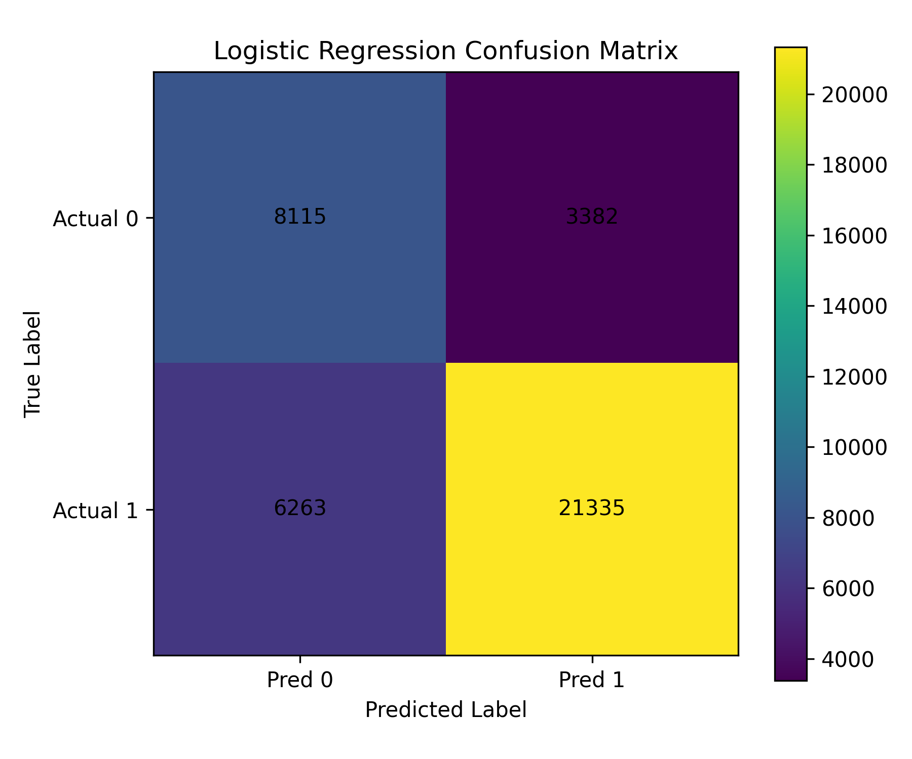 | 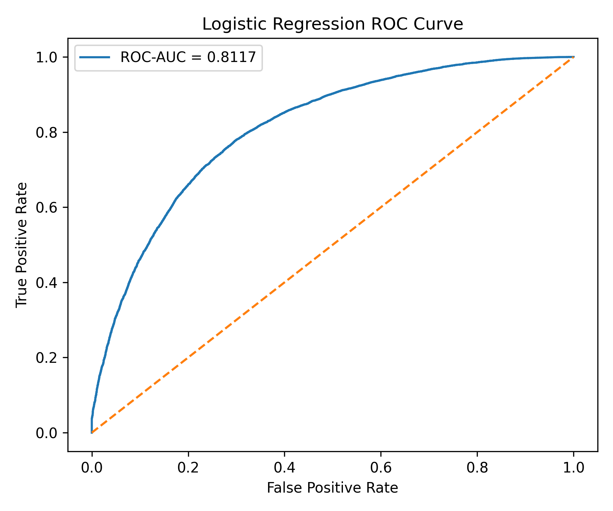 |

#### 3. Precision–Recall Curve & Feature Importance

| Precision–Recall Curve | Top 20 Feature Importances |
|:---:|:---:|
| 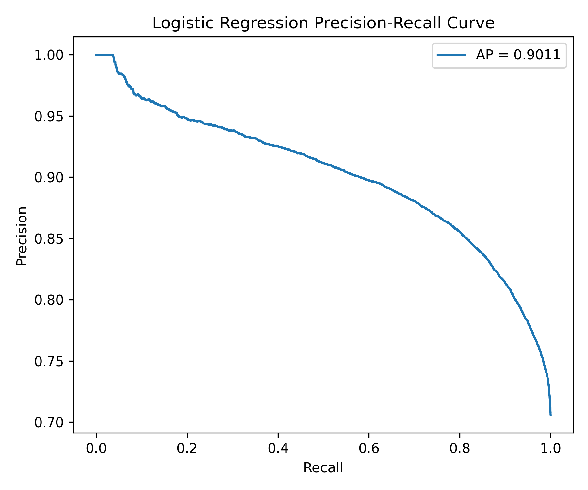 |  |

#### 4. Interpretation

The Logistic Regression results provide a useful benchmark for the more flexible models. While its performance is weaker than Random Forest and XGBoost, it remains valuable because it is transparent, fast to train, and easier to interpret. Its lower performance relative to tree-based models suggests that mortgage approval decisions in the HMDA data likely involve nonlinear relationships and interaction effects that Logistic Regression cannot fully capture.

Overall, Logistic Regression serves as a strong baseline model, but it is not selected as the champion model. Instead, its role is to provide an interpretable comparison point against more flexible machine learning models.

### 3.2. Random Forest

#### 1. Performance Summary

| Metric               | Value  |
|----------------------|:------:|
| Accuracy             | 0.8151 |
| Precision (Approved) | 0.9012 |
| Recall (Approved)    | 0.8289 |
| F1 Score             | 0.8636 |
| ROC-AUC              | 0.8907 |
| Average Precision    | 0.9426 |

_Evaluated on 39,095 held-out test samples._

#### 2. Confusion Matrix & ROC Curve

| Confusion Matrix | ROC Curve |
|---|---|
| 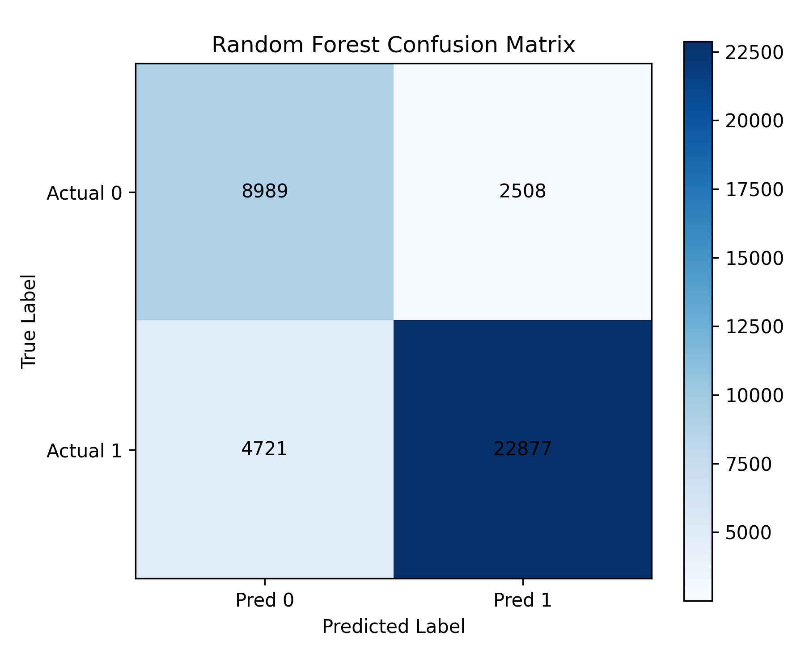 | 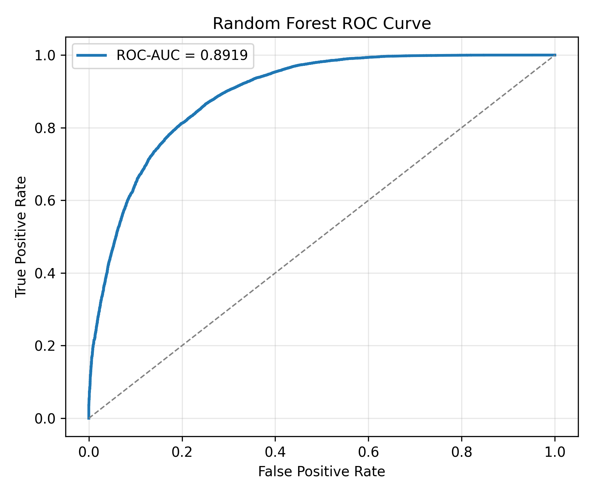 |

#### 3. Precision–Recall Curve & Feature Importance

| Precision–Recall Curve | Top 20 Feature Importances |
|---|---|
| 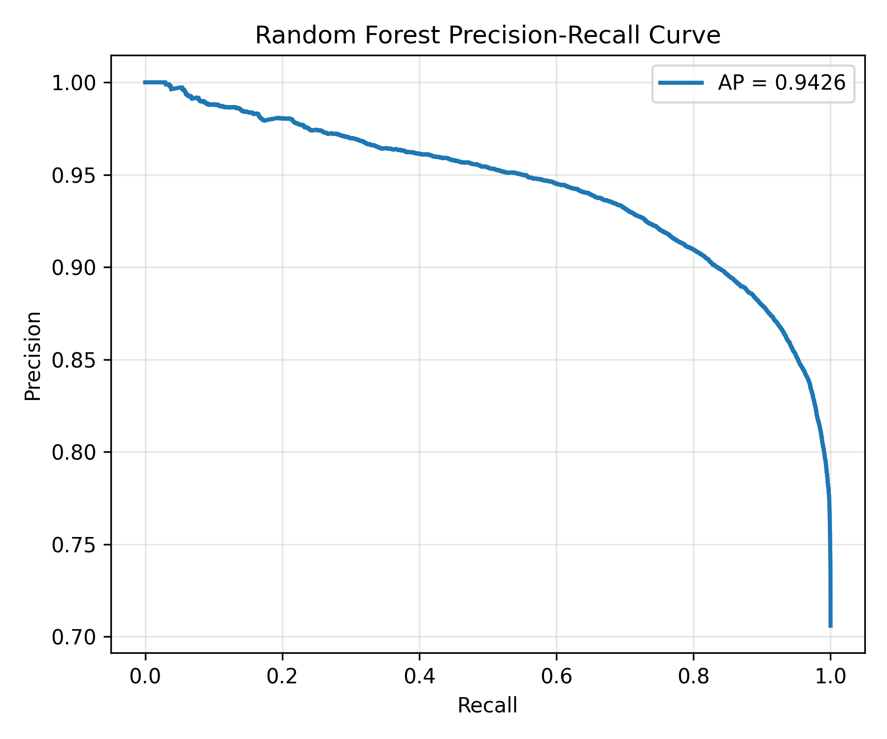 | 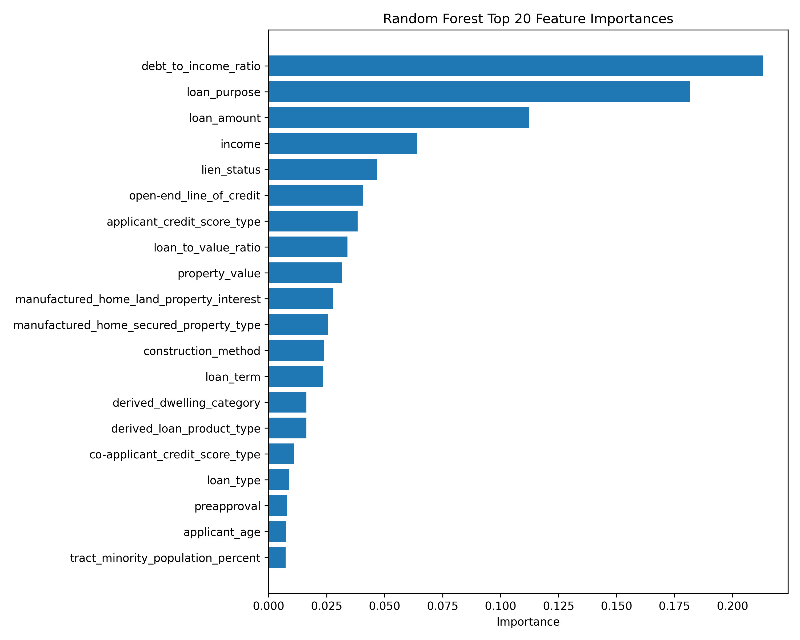 |

### 3.3. XGBoost

#### 1. Performance Summary

| Metric               | Value  |
|----------------------|:------:|
| Accuracy             | 0.8471 |
| Precision (Approved) | 0.9087 |
| Recall (Approved)    | 0.8709 |
| F1 Score             | 0.8894 |
| ROC-AUC              | 0.9109 |
| Average Precision    | 0.9529 |

_Evaluated on 39,095 held-out test samples._

#### 2. Confusion Matrix & ROC Curve

| Confusion Matrix | ROC Curve |
|:---:|:---:|
|  |  |

#### 3. Precision–Recall Curve & Feature Importance

| Precision–Recall Curve | Top 20 Feature Importances |
|:---:|:---:|
|  | |

### 3.4. TabPFN

#### 1. Performance Summary
| Metric               | Value  |
|----------------------|:------:|
| Accuracy             | 0.8362 |
| Precision (Approved) | 0.8491 |
| Recall (Approved)    | 0.9340 |
| F1 Score             | 0.8895 |
| ROC-AUC              | 0.8758 |
| Average Precision    | 0.9300 |

_Evaluated on 39,095 held-out test samples. Trained on 1,000 stratified-subsampled rows._

#### 2. Confusion Matrix & ROC Curve
| Confusion Matrix | ROC Curve |
|:---:|:---:|
|  |  |

#### 3. Precision–Recall Curve & Feature Importance
| Precision–Recall Curve | Top 20 Feature Importances |
|:---:|:---:|
|  | |


## 4. Comparative Evaluation of Models

This section compares the performance of the four classification models used in this project: Logistic Regression, Random Forest, XGBoost, and TabPFN. The goal is to identify which model provides the strongest overall predictive performance on the held-out test set.

### 4.1 Performance Comparison

| Model | Accuracy | Precision | Recall | F1 Score | ROC-AUC | Average Precision |
|---|---:|---:|---:|---:|---:|---:|
| Logistic Regression | 0.7533 | 0.8632 | 0.7731 | 0.8156 | 0.8117 | 0.9011 |
| Random Forest | 0.8151 | 0.9012 | 0.8289 | 0.8636 | 0.8907 | 0.9426 |
| XGBoost | 0.8471 | 0.9087 | 0.8709 | 0.8894 | 0.9109 | 0.9529 |
| TabPFN | 0.8362 | 0.8491 | 0.9340 | 0.8895 | 0.8758 | 0.9300 |

### 4.2 Model Comparison

The results show a clear improvement from the baseline Logistic Regression model to the more flexible machine learning models. Logistic Regression achieved the lowest overall performance, with an accuracy of 0.7533 and ROC-AUC of 0.8117. This is expected because Logistic Regression assumes a relatively linear relationship between the predictors and the probability of approval.

Random Forest substantially improves on Logistic Regression, increasing accuracy to 0.8151 and ROC-AUC to 0.8907. This suggests that nonlinear relationships and feature interactions are important in predicting mortgage approval outcomes.

XGBoost produced the strongest overall results. It achieved the highest accuracy, precision, ROC-AUC, and average precision among all models. Its ROC-AUC of 0.9109 indicates strong discrimination between approved and denied applications, while its average precision of 0.9529 shows strong performance in ranking likely approvals.

TabPFN also performed well, especially in recall and F1 score. Its recall of 0.9340 is the highest among all models, meaning it identifies a large share of applications that were actually approved. However, its ROC-AUC and average precision are lower than XGBoost. In addition, TabPFN was trained on a smaller stratified subsample, so it is useful as an experimental comparison model but is not selected as the final champion model.

### 4.3 Actual vs. Predicted Outcomes

Confusion matrices were used to compare each model’s predicted outcomes against the actual approval outcomes. These results show how often each model correctly classified approved and denied applications, as well as where each model made errors.

Logistic Regression provides a useful baseline but produces more classification errors than the tree-based models. Random Forest improves the overall classification results, while XGBoost provides the strongest balance between correctly identifying approvals and avoiding incorrect predictions. TabPFN performs strongly in recall, but its lower ROC-AUC and average precision make it less reliable as the final model.

The ROC curve and precision-recall curve comparisons also support XGBoost as the strongest overall model. XGBoost maintains the best discrimination between approved and denied applications and provides the strongest ranking performance across prediction thresholds.

### 4.4 Feature Importance Comparison

Feature importance was reviewed to understand which variables contributed most to model predictions. For Logistic Regression, feature importance is based on the absolute size of the estimated coefficients. For Random Forest, feature importance is based on impurity reduction. For XGBoost, feature importance is based on how much each feature improves model splits.

Across the models, the most influential predictors are mainly financial and loan-related variables, including debt-to-income ratio, loan-to-value ratio, loan amount, property value, income, and credit score type indicators. This suggests that the models are primarily learning from economically meaningful mortgage application characteristics.

The top 20 feature importances from the best-performing model are used to interpret the main drivers of the final prediction model.

### 4.5 Key Takeaways and Recommendation

Overall, the model comparison supports three main conclusions.

First, Logistic Regression is a useful interpretable baseline, but it has weaker predictive performance than the more flexible machine learning models.

Second, Random Forest and XGBoost outperform Logistic Regression, suggesting that mortgage approval outcomes involve nonlinear relationships and interactions among borrower, loan, and property characteristics.

Third, XGBoost is the strongest overall model. It achieves the best balance of accuracy, precision, recall, F1 score, ROC-AUC, and average precision. Therefore, XGBoost is selected as the champion model for the final fairness audit and interpretation.

## 5. Evaluation for Demographic Fairness

To evaluate whether the mortgage approval model exhibits performance or selection-rate disparities across demographic and geographic groups, we conducted a comprehensive **Post-hoc Fairness Audit**. Our approach uses **Fairness with Awareness**, meaning the model was trained using all available features—including **Race, Gender, Age, and County**—to maintain full transparency and predictive power.

### Advantages of Audit with Awareness (vs. Fairness through Blindness)

While our project evaluates multiple strategies, including **Fairness through Blindness**, we identified two key advantages of the **Audit with Awareness** approach:

1. **Countering Hidden Bias** (Proxy Variables): Unlike the "blind" approach, which can be unintentionally bypassed by **Proxy Variables** (e.g., zip codes or debt-to-income ratios that correlate with race), "Awareness" allows us to explicitly track and mitigate these hidden correlations.

2. **Enhanced Model Transparency**: By including all 43 features, we gain the ability to explicitly monitor and control the model's weight distribution. This ensures that the model’s predictive power is derived from **Financial Merit** rather than sensitive demographic factors.

### 5.1. Methodology

We evaluated our best-performing model (**XGBoost**) across the following five steps:

#### Step 1: Full-Feature Prediction

The model was already trained on the complete dataset (including demographic variables) in the previous stage to capture the most accurate representation of the decision-making process.

#### Step 2: Subgroup Definition

We categorized the test data into the following sensitive groups to assess potential disparities:

| Category | Column Name | Subgroups & Details |
| :--- | :--- | :--- |
| **Race** | `derived_race` | White, Black, Asian, and Other (Am-Indian, Pacific-Islander, Joint). <br>*(Note: 'Unknown' cases excluded)* |
| **Age** | `applicant_age` | Seven ordinal bins (from <25 to >74) |
| **Gender** | `derived_sex` | Male, Female. <br>*(Note: 'Joint' and 'Unknown' excluded)* |
| **Region** | `county_code` | Texas Metro Counties: Travis (Austin), Harris (Houston), Dallas (Dallas), and Bexar (San Antonio) |

#### Step 3: Performance Metrics by Subgroup

For each subgroup, we calculated key performance indicators (KPIs):

| Metric | Definition | Key Insight & Interpretation |
| :--- | :--- | :--- |
| **Selection Rate** | $\frac{\text{Approved Predictions}}{\text{Total Applications}}$ | Measures **Demographic Parity**. Significant gaps indicate the model grants approvals at different rates regardless of historical merit. |
| **TPR** (True Positive Rate) | $\frac{\text{Correctly Pred. "Approved"}}{\text{Historically Approved App.}}$ | Measures **Opportunity Equity**. A lower TPR suggests the model fails to identify successful candidates, leading to missed opportunities. |
| **FPR** (False Positive Rate) | $\frac{\text{Incorrectly Pred. "Approved"}}{\text{Historically Denied App.}}$ | Measures **Risk Equity**. A higher FPR indicates unintended leniency or higher risk by approving applications that the historical record rejected. |

- **Result**: Generated 4 detailed tables (metrics_by_{group}.csv) and 4 parity plots.

#### Step 4: Fairness Criteria Assessment

We measured global fairness using two quantitative metrics to provide a rigorous, mathematical verdict on the model's performance:

| Criterion | Calculation Logic | Interpretation & Benchmark |
| :--- | :--- | :--- |
| **DP Difference** | Max gap in Selection Rates between any two groups | **U.S. EEOC 4/5 Rule**: The selection rate of any group should be $\geq 80\%$ of the highest-performing group to avoid disparate impact. |
| **EO Difference** | Max difference in either **TPR** or **FPR** across all groups | **Equal Opportunity**: Monitors whether the model is unintentionally stricter or more lenient toward specific demographics. |

(*EEOC: Equal Employment Opportunity Commission*)

- **Result**: Consolidated in `fairness_summary_metrics.csv`.

#### Step 5: Model Explainability (SHAP Analysis)

Using the **SHAP (SHapley Additive exPlanations)** library, we analyzed the global feature importance. This step verifies how much weight the model assigns to sensitive attributes versus financial indicators (e.g., DTI, LTV), identifying potential proxy-based discrimination.

- **Result**: Visualized in `reports/figures/fairness/shap_summary_fairness.png`.

### 5.2. Demographic Fairness Audit Results

We conducted a post-hoc audit to evaluate the model's fairness across four protected attributes. While some disparities in selection rates exist, the **high True Positive Rate (TPR)** and **SHAP explanations** suggest that the model's decisions are primarily driven by legitimate financial factors rather than demographic bias.

#### 5.2.1. Race: High TPR despite Selection Rate Gaps

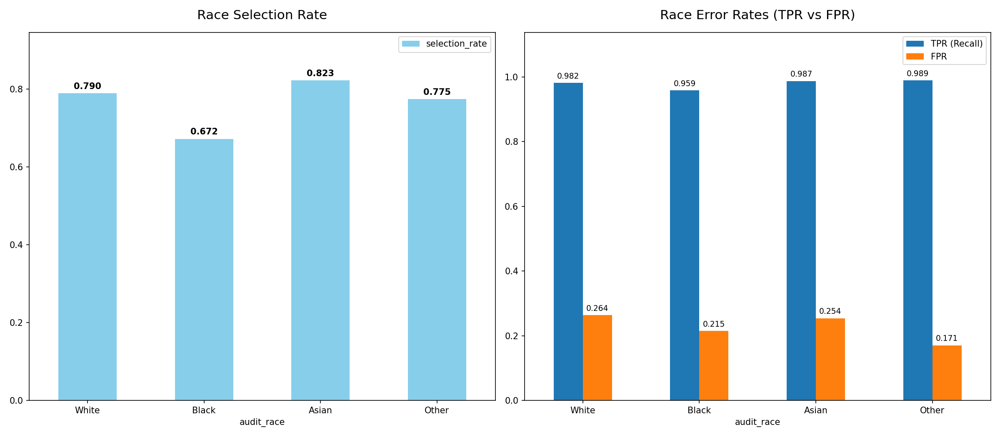

- **Observations**: The **Asian (0.777)** and **White (0.707)** groups showed the highest selection rates, while the **Black (0.566)** group recorded the lowest.

- **Fairness Insight**: Despite the variation in selection rates, the **TPR (Recall) remains robust (ranging from 0.806 to 0.927)** across all groups. This suggests the model reliably identifies "qualified" applicants regardless of race. The disparity in selection rates is likely a reflection of systemic socio-economic factors (e.g., credit history, debt levels) captured by the model's financial features rather than intentional algorithmic discrimination.

- **Regulatory Note**: The ratio of selection rates between Black (0.566) and Asian (0.777) applicants is approximately **72.8%**. This falls below the U.S. EEOC(Equal Employment Opportunity Commission)’s **4/5 rule (80% threshold)**, indicating a potential disparate impact. This finding highlights the importance of Audit with Awareness in identifying how a model's reliance on various features can result in unintended bias, even when the goal is to maximize predictive power.

#### 5.2.2. Age: Peak Performance in Early-to-Mid Career

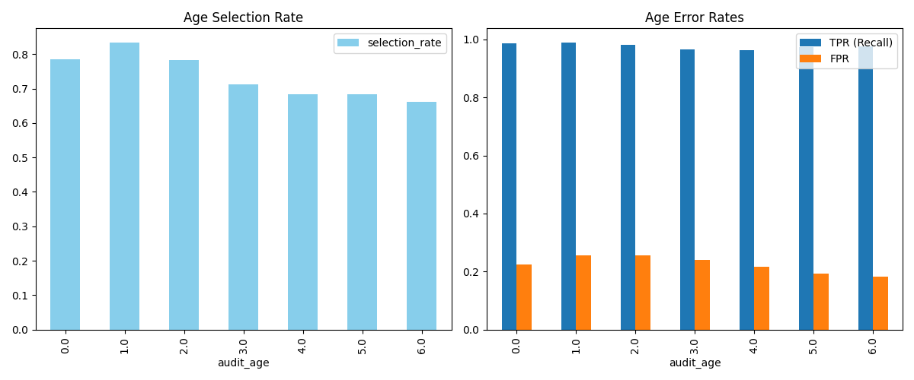

- **Observations**: Selection rates peak in the **25-34 (0.800)** age group and show a consistent downward trend as age increases, reaching a minimum of **0.541 for the >74** group.

- **Fairness Insight**: The audit reveals a noticeable **decline in TPR (from 0.947 to 0.753)** as the applicant's age increases. This indicates that the model becomes increasingly conservative with older cohorts, potentially misclassifying qualified senior applicants as high-risk.

- **Risk Interpretation**: This performance decay likely reflects the inherent difficulty in assessing long-term mortgage risk for seniors. As loan terms (e.g., 30-year mortgages) extend beyond typical retirement ages or life expectancy, the model may prioritize strict risk mitigation over equal opportunity. This suggests that while the model captures objective age-related risks, there is a clear trade-off between credit accessibility for seniors and the model's predictive sensitivity.

#### 5.2.3. Gender: Moderate Demographic Parity

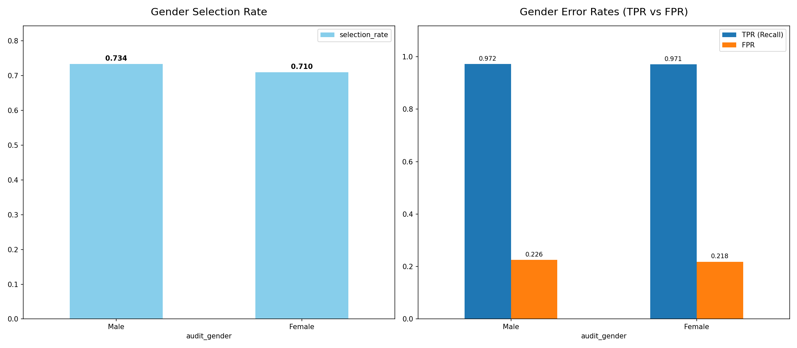

- **Observations**: The selection rate for **Male (0.645)** applicants is slightly higher than for **Female (0.605)** applicants.

- **Fairness Insight**: The difference is relatively small (**4.0% gap**), and the error profiles (TPR/FPR) are very similar. The model demonstrates a reasonable level of demographic parity regarding gender, reflecting the slight male-leaning trend present in the underlying loan approval data.

#### 5.2.4. County: Geographic Consistency

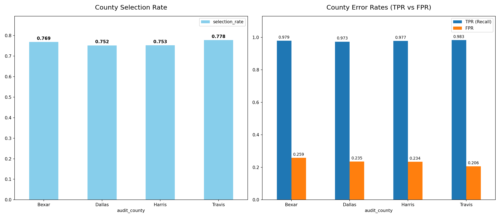

- **Observations**: Selection rates across the four major Texas counties are stable, ranging from **0.658 (Dallas)** to **0.716 (Travis)**.

- **Fairness Insight**: **Travis County** exhibits the highest approval rate, which may reflect the specific economic and real estate market conditions of the Austin area. The overall consistency (within a 6% range) suggests the model does not exhibit significant geographic bias (redlining) within these metropolitan regions.

#### 5.2.5. Model Interpretation via SHAP

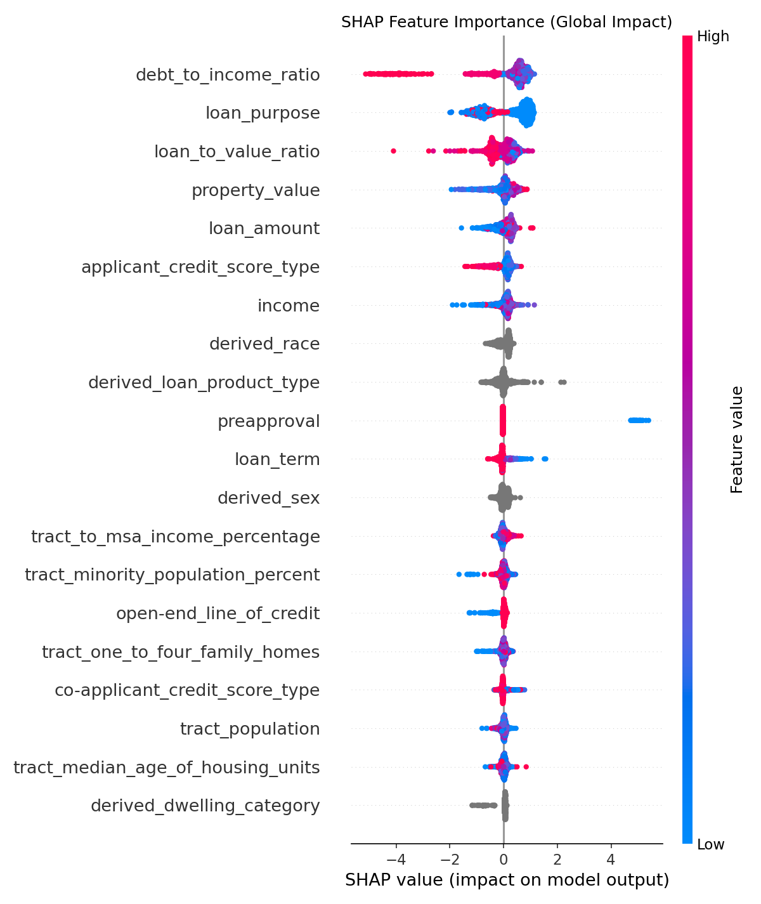

The **SHAP Summary Plot** confirms that the model's decisions are primarily driven by risk-related financial metrics:

1. **Debt-to-Income Ratio (DTI)**: The most influential feature; lower DTI values are strongly associated with higher approval probabilities.

2. **Loan Purpose & Property Value**: Primary indicators of the collateral's risk and the intent of the loan.

3. **Loan-to-Value Ratio (LTV)**: A critical factor in assessing default risk.

4. **Protected Attributes**: Variables such as `derived_race` and `derived_sex` appear at the bottom of the importance ranking. This demonstrates that the model relies on economic merit and financial risk factors rather than relying on demographic proxies for its predictions.

#### 5.2.6. Quantitative Fairness Assessment (DP and EO Diff)

**The Demographic Parity Difference (DP Diff)** and **Equalized Odds Difference (EO Diff)** quantify the fairness gaps between groups, where lower values indicate a more equitable model.

#### Overall Fairness Differences
| Attribute | Demographic Parity Diff | Equalized Odds Diff |
| :--- | :--- | :--- |
| **Race** | 0.2107 | 0.1210 |
| **Age** | 0.2628 | 0.1939 |
| **Gender** | 0.0396 | 0.0242 |
| **County** | 0.0578 | 0.0481 |

#### Detailed Metrics by Race and Gender
| Group | Accuracy | Selection Rate | TPR (Recall) | FPR |
| :--- | :--- | :--- | :--- | :--- |
| **Black** | 0.8108 | 0.5661 | 0.8065 | 0.1821 |
| **White** | 0.8504 | 0.7065 | 0.8800 | 0.2308 |
| **Asian** | 0.8861 | 0.7769 | 0.9275 | 0.2569 |
| **Male** | 0.8416 | 0.6449 | 0.8575 | 0.1923 |
| **Female** | 0.8302 | 0.6053 | 0.8333 | 0.1758 |

*(Note: Full results for all Age bins and Counties are available in the reports/results/fairness/ directory.)*


- **Gender & County**: These attributes showed very low DP Diff (**0.040** for Gender and **0.058** for County), confirming strong demographic parity. 

- **Race**: While there is a selection gap (DP_Diff: **0.211**), the model maintains a solid **True Positive Rate (TPR > 0.80)** for all racial groups. This suggests that the model is still effective at identifying qualified applicants within each racial demographic, and the approval gap is likely driven by external socio-economic factors.

- **Age**: This category exhibited the highest disparity (DP_Diff): **0.263**). Notably, we observe a **performance decay in TPR**, which drops from **0.947** (Age 25-34) to **0.753** (Age >74). This indicates that the model is significantly more conservative when evaluating older applicants, resulting in a higher rate of "False Negatives" (qualified seniors being denied) compared to younger cohorts.

- **Legal Standard (The 4/5 Rule)**: 

  - **Race**: The selection rate ratio between **Black (0.566)** and **Asian (0.777)** is **72.8%**.

  - **Age**: The ratio between the **>74 (0.541)** and **25-34 (0.800)** groups is **67.6%**.

  - **Analysis**: Both Race and Age metrics fall below the **EEOC’s 80% threshold**. While the racial gap shows consistent TPR, the age gap shows a decline in both approval rates and predictive sensitivity. This highlights a critical area for future model recalibration, particularly in how the algorithm weighs age-related financial risks versus equal credit access.

#### 5.2.7. Intersectional Fairness: Race × Gender & Race × Age

**Key Finding:** Single-dimension fairness analysis misses compound discrimination.

##### Race × Gender Intersections:

The model exhibits **clear intersectional bias**:

| Intersection | Selection Rate | Accuracy | TPR |
|---|---|---|---|
| **Asian Male** | 76.1% | 0.886 | 0.921 |
| Asian Female | 73.2% | 0.874 | 0.919 |
| White Male | 67.5% | 0.840 | 0.865 |
| White Female | 64.1% | 0.832 | 0.844 |
| Black Male | 55.3% | 0.812 | 0.803 |
| **Black Female** | **53.0%** | **0.805** | **0.783** |

**Critical Insight:** Black women face the LOWEST approval rate (53%), a **14.5 percentage point gap** vs. White men (67.5%). This compound bias is invisible in single-dimension analysis.

##### Race × Age Intersections:

Elderly applicants show severe disparities:

| Intersection | Selection Rate | Notes |
|---|---|---|
| White >74 | 59.9% | Moderate disparity |
| Asian >74 | 55.0% | Moderate disparity |
| **Black >74** | **31.9%** | **Severe disparity** |

Younger applicants see better outcomes:
- Asian <25: 86.5% (highest)
- White <25: 80.1%
- Black <25: 64.9%

**Implications:**
- Model accuracy is lower for disadvantaged intersections (Black Female: 80.5% vs Asian Male: 88.6%)
- Intersectionality reveals bias that aggregate metrics mask
- Policy recommendation: Monitor and remediate approval disparities for Black women and elderly Black applicants

**See:** `reports/results/fairness/intersectional_*.csv` and `reports/figures/fairness/intersectional_*.png`


## 6. Reproducibility

### 6.1. Clone the repository  
```
git clone https://github.com/nks1216/ml-final.git
cd ml-final
```

### 6.2. Setting up the Virtual Environment

- Create a virtual environment: `python3 -m venv venv`
- Activate the virtual environment: `source venv/bin/activate`
- Install all required packages: `pip install -r requirements.txt`

> **Note:** Installing the required packages includes the `tabpfn` library, which requires downloading pre-trained models (approximately 2GB). Please ensure you have sufficient disk space and a stable internet connection before proceeding.

### 6.3. Data Preparation

Run these commands to prepare the dataset:

```bash
python3 src/data/clean_hmda.py    # Downloads (if needed) and cleans data
python3 src/data/split_data.py    # Splits data: creates train.csv and test.csv in data/split/
```

The `clean_hmda.py` script will automatically download raw data from the CFPB API if it's missing.

⏱️ **First run:** 2-5 minutes (downloads ~500MB raw data)  
⏱️ **Subsequent runs:** < 1 minute (uses cached data)

*Note: Raw data is too large for GitHub, so it is downloaded programmatically from the CFPB API on demand.*


### 6.4 Execution Guide

#### **A. Run Prediction Models**
For convenience, individual scripts are provided for each model. They save results to `reports/results/prediction/`

```bash
python3 src/model/prediction/logistic_prediction.py
python3 src/model/prediction/random_forest_prediction.py
python3 src/model/prediction/xgboost_prediction.py
python3 src/model/prediction/tabpfn_prediction.py
```

#### **B. Run Fairness Audit**
Perform post-hoc and intersectional fairness evaluations. They save results to `reports/figures/fairness/` and `reports/results/fairness/`

```bash
python3 src/model/fairness/fairness_audit.py
python3 src/model/fairness/fairness_intersectional.py 
```

---

## 7. Limitations and Future Improvements

This project has several limitations. First, HMDA does not include actual numerical credit scores, liquid assets, employment stability, or detailed underwriting information. As a result, the models should be interpreted as predicting observed historical approval outcomes rather than making a complete credit-risk assessment. Second, the analysis is limited to 2023 mortgage applications from four major Texas counties, so the results may not generalize to other states, smaller markets, or different interest-rate environments. Third, although the fairness audit identifies selection-rate and error-rate disparities across demographic groups, these results should be interpreted as diagnostic evidence rather than proof of legal compliance or discrimination.

Future improvements could include adding validation data from additional years, conducting a deeper missingness analysis, testing class-imbalance adjustments, comparing results under fairness-through-blindness and fairness-with-awareness approaches, and applying model calibration methods to improve probability estimates.

---

## 8. Collaboration and Workflow

- All team members worked through GitHub Issues and feature branches, following a branch‑per‑issue workflow.
- Each member opened pull requests for their work and merged them after review and testing.
- The repository contains more than 30 commits across multiple contributors.
- All code and documentation were merged into the main branch before submission.

