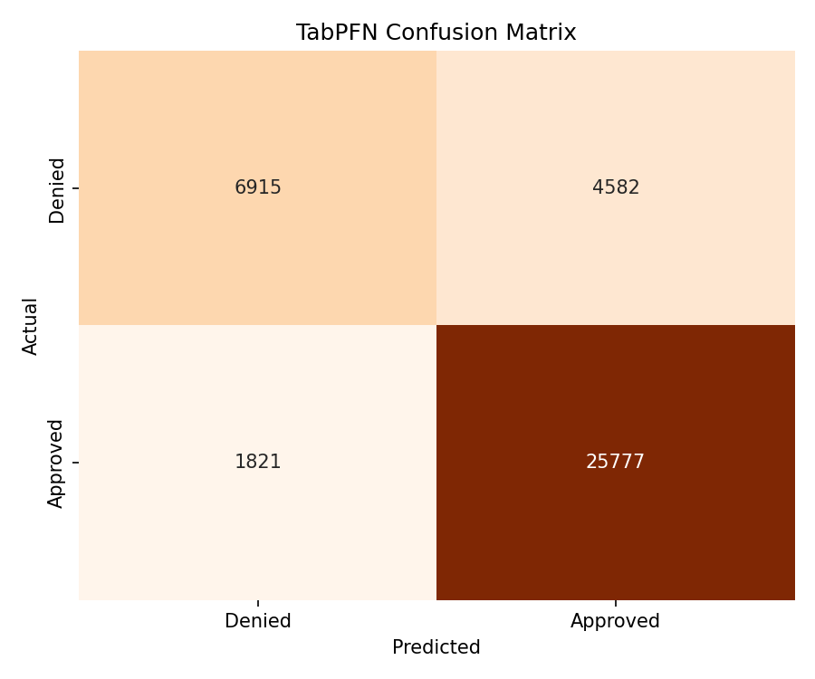
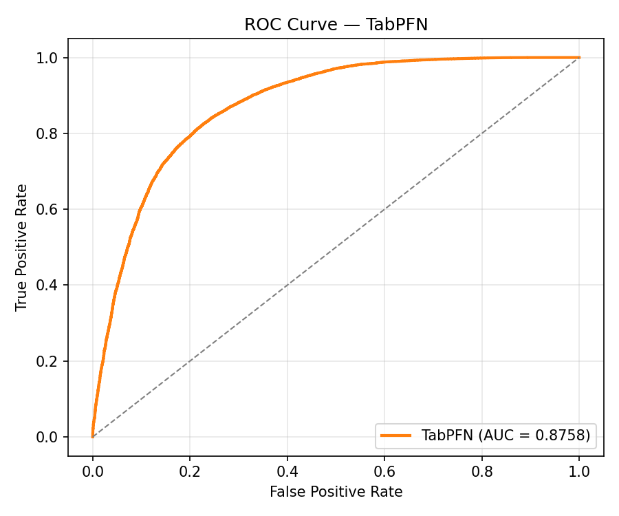
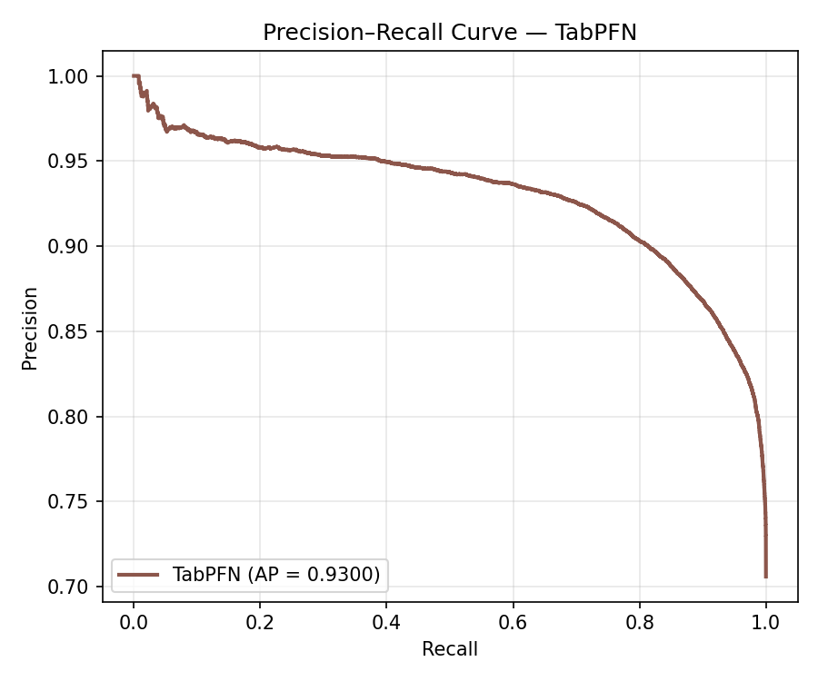

# TabPFN — HMDA Loan Approval Prediction

Predicting whether a mortgage application is **Approved (1)** or **Denied (0)** using **TabPFN** (Tabular Prior-Data Fitted Network), a pretrained transformer designed specifically for tabular data.

---

## 1. Model Approach

TabPFN is a **completely different paradigm** from the other models in this project. Unlike Logistic Regression, Random Forest, and XGBoost — which learn parameters from your data via gradient steps or tree splits — TabPFN was **pretrained once on millions of synthetic datasets** by the authors. At inference time it does no training: your data is fed directly into the transformer as context, and predictions come out via in-context learning (similar to how an LLM "learns" from the prompt).

**Key constraint:** TabPFN v2 is designed for ≤ ~10,000 training rows. Our HMDA training set has 156,379 rows, so we **stratified-subsample to 10,000 rows** while preserving the 70/30 class ratio. The full 39,095-row test set is still used for evaluation, so test-side comparisons with the other models remain fair.

The pipeline in [`tabpfn_prediction.py`](./tabpfn_prediction.py) does the following:

1. **Load** pre-split data from `data/split/train.csv` (156,379 rows) and `data/split/test.csv` (39,095 rows).
2. **Label-encode** the 7 categorical features and record their column indices.
3. **Stratified-subsample** the training set to 10,000 rows.
4. **Fit** `TabPFNClassifier(device="auto", n_estimators=4)` — this just stores the data for in-context inference.
5. **Predict** on the full 39,095-row test set.
6. **Evaluate** with accuracy, precision, recall, F1, ROC-AUC, PR-AUC, confusion matrix.
7. **Interpret** via permutation importance on a 1,000-row test subsample (TabPFN inference is too slow for the full test set in a permutation loop).

---

## 2. Setup (One-time)

### 2.1 Install
```bash
pip install tabpfn
```

### 2.2 License & API Token (required)

TabPFN downloads its pretrained weights from Hugging Face under a free license that requires a one-time acceptance:

1. Register / log in at <https://ux.priorlabs.ai>
2. Accept the license on the **Licenses** tab
3. Copy your API key from <https://ux.priorlabs.ai/account>
4. Export it before running:
   ```bash
   export TABPFN_TOKEN="<your-api-key>"
   ```

### 2.3 Run
```bash
python3 src/model/prediction/tabpfn_prediction.py
```

> **Runtime expectation:** On a Mac CPU, fitting + predicting on the full 39K test set takes roughly **5–20 minutes** depending on hardware. Permutation importance adds another 5–15 minutes. If you have an Apple Silicon GPU, TabPFN will auto-select MPS for a noticeable speedup.

---

## 3. Results

### 3.1 Performance Summary

| Metric               | Value  |
|----------------------|:------:|
| Accuracy             | 0.8362 |
| Precision (Approved) | 0.8491 |
| Recall (Approved)    | 0.9340 |
| F1 Score             | 0.8895 |
| ROC-AUC              | 0.8758 |
| Average Precision    | 0.9300 |

_Evaluated on 39,095 held-out test samples (full test set). Trained on 1,000 stratified-subsampled training rows due to CPU runtime constraints — TabPFN's in-context inference scales linearly with training set size, so reducing from 10K to 1K samples cuts inference time by ~10× with only a modest drop in performance._

### 3.2 Confusion Matrix & ROC Curve

| Confusion Matrix | ROC Curve |
|:---:|:---:|
|  |  |

### 3.3 Precision–Recall Curve

<p align="center">
  
</p>

### 3.4 Feature Importance

Permutation feature importance was **not computed** for TabPFN in this run — each permutation triggers a full re-prediction over the test sample, and on CPU this takes 1–2 hours. TabPFN is also an in-context learning model with no native feature importance score, so direct comparison with the gain-based importance from XGBoost/Random Forest is not straightforward in any case. To enable it, set `COMPUTE_FEATURE_IMPORTANCE = True` in the script.

---

## 4. Caveats for Comparison

When comparing TabPFN with XGBoost / Random Forest / Logistic Regression:

- TabPFN was **trained on 10,000 rows**; the others were trained on the **full 156,379 rows**. This is not a defect — TabPFN is designed for small data — but the comparison should note this difference.
- TabPFN may benefit if you add a **bagged variant** (train multiple TabPFN instances on different 10K subsamples and average predictions), but this is left as a future extension.

---

## 5. Output Artifacts

All outputs saved to `reports/results/prediction/`:

- `tabpfn_confusion_matrix.png` / `.csv`
- `tabpfn_roc_curve.png`
- `tabpfn_precision_recall_curve.png`
- `tabpfn_feature_importance_top20.png` / `tabpfn_feature_importance_all.csv`
- `tabpfn_metrics.json`, `tabpfn_classification_report.csv`
- `tabpfn_test_predictions.csv`
